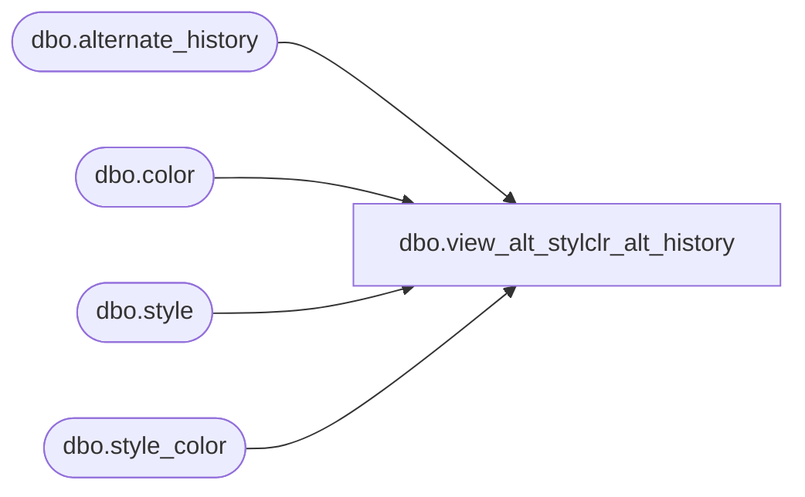

# dbo.view_alt_stylclr_alt_history

**Database:** me_01  
**Server:** bedrockdb02  

## Architecture Diagram



## Table Dependencies

| Referenced Table |
|---|
| dbo.alternate_history |
| dbo.color |
| dbo.style |
| dbo.style_color |

## View Code

```sql
create view dbo.view_alt_stylclr_alt_history AS
SELECT DISTINCT
  s.style_code alt_style_code,
  s.long_desc alt_long_desc,
  s.short_desc alt_short_desc,
  sc.style_color_id alt_style_color_id,
  sc.long_desc alt_style_color_long_desc, 
  sc.short_desc alt_style_color_short_desc,
  c.color_code alt_color_code,
  c.color_long_description alt_color_long_desc,
  c.color_short_description alt_color_short_desc
FROM  style s
INNER JOIN style_color sc
ON s.style_id = sc.style_id
INNER JOIN color c
ON sc.color_id = c.color_id
WHERE sc.style_color_id in (SELECT DISTINCT alt_style_color_id FROM alternate_history)


dbo,view_ap_merch_hier_grp_lwstlvl,create view [dbo].[view_ap_merch_hier_grp_lwstlvl] as
select distinct(hg.hierarchy_group_id), hg.hierarchy_group_code, hg.hierarchy_group_label,
hg.hierarchy_group_short_label, alternate_flag  
from  hierarchy_group hg, hierarchy_level l, hierarchy h
where hg.hierarchy_level_id = l.hierarchy_level_id
and hg.hierarchy_id = h.hierarchy_id
and l.hierarchy_level_id NOT IN 
(select hierarchy_level_id from hierarchy_level where hierarchy_level_id in 
(select parent_level_id from hierarchy_level))
and h.hierarchy_type = 1

dbo,view_ap_style_all_merch_grp,create view [dbo].[view_ap_style_all_merch_grp] as
select 
s.style_id,
sg.hierarchy_group_id,
hierarchy_group_code,
hierarchy_group_label,
hierarchy_group_short_label,
reclass_pending_flag,
reclass_to_group_id,
reclass_move_history_flag
from view_style_cs s
left outer join view_style_group_cs sg
    inner join hierarchy_group hg on (hg.hierarchy_group_id = sg.hierarchy_group_id)
on s.style_id = sg.style_id

dbo,view_ap_style_all_mrch_grp_prt,create view [dbo].[view_ap_style_all_mrch_grp_prt] as
select 
s.style_id,
pg.parent_hierarchy_group_id 
from view_style_cs s
left outer join view_style_group_cs sg
    inner join hierarchy_group hg on (hg.hierarchy_group_id = sg.hierarchy_group_id)
		inner join merch_group_parent pg on (hg.hierarchy_group_id = pg.hierarchy_group_id)
on s.style_id = sg.style_id
```

