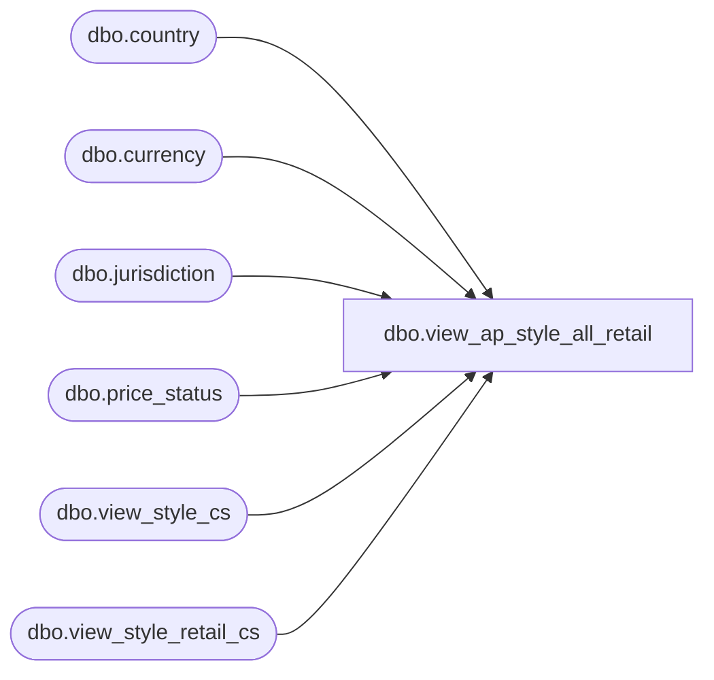

# dbo.view_ap_style_all_retail

**Database:** me_01  
**Server:** bedrockdb02  

## Architecture Diagram



## Table Dependencies

| Referenced Table |
|---|
| dbo.country |
| dbo.currency |
| dbo.jurisdiction |
| dbo.price_status |
| dbo.view_style_cs |
| dbo.view_style_retail_cs |

## View Code

```sql
create view view_ap_style_all_retail as
select s.style_id,
sr.compare_at_retail,
sr.original_valuation_retail,
sr.original_selling_retail,
sr.original_price_status_id,
ops.price_status_code as orig_price_status_code,
ops.price_status_desc as orig_price_status_desc,
sr.current_valuation_retail,
sr.current_selling_retail,
sr.current_price_status_id, 
cps.price_status_desc as curr_price_status_desc,
cps.price_status_code as curr_price_status_code,
jurisdiction_description,  jurisdiction_code, currency_code, currency_description, currency_symbol
from view_style_cs s
left outer join view_style_retail_cs sr inner join jurisdiction j 
                                           on (j.jurisdiction_id = sr.jurisdiction_id)
                                        inner join country c
                                          on (j.country_id = c.country_id)
                                        inner join currency cc
                                          on (c.currency_id = cc.currency_id)  
on sr.style_id = s.style_id
left outer join price_status ops
on ops.price_status_id = sr.original_price_status_id
left outer join price_status cps
on cps.price_status_id = sr.current_price_status_id
```

