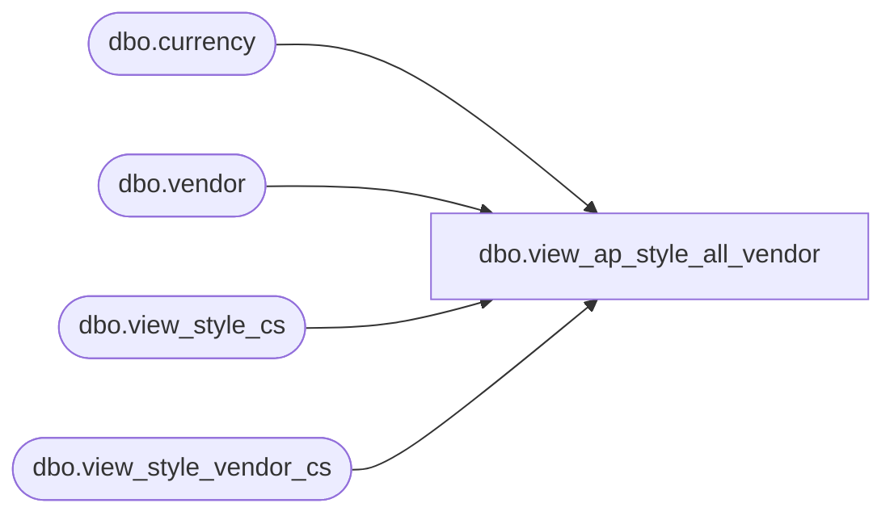

# dbo.view_ap_style_all_vendor

**Database:** me_01  
**Server:** bedrockdb02  

## Architecture Diagram



## Table Dependencies

| Referenced Table |
|---|
| dbo.currency |
| dbo.vendor |
| dbo.view_style_cs |
| dbo.view_style_vendor_cs |

## View Code

```sql
create view [dbo].[view_ap_style_all_vendor] as 
select style_vendor_id, s.style_id, sv.vendor_id, sv.vendor_style, alternate_vendor_code,
vendor_code as vendor_code, vendor_name as vendor_name, current_cost as current_cost, sv.currency_id as currency_id,
currency_code as currency_code, currency_description as currency_description, currency_symbol as currency_symbol, primary_vendor_flag
from view_style_cs s 
left outer join view_style_vendor_cs sv on s.style_id = sv.style_id
left outer join currency c on sv.currency_id = c.currency_id
left outer join vendor v on sv.vendor_id = v.vendor_id
dbo,view_ap_style_attributes,create view [dbo].[view_ap_style_attributes] as
select s.style_id, attribute_code, attribute_label, attribute_set_code, attribute_set_label
from view_style_cs s
	left outer join view_entity_attribute_set_cs sa
		inner join attribute a on (sa.attribute_id = a.attribute_id)
		inner join attribute_set ats on (sa.attribute_set_id = ats.attribute_set_id)
	on sa.parent_type = 1 and sa.parent_id = s.style_id

dbo,view_ap_style_color,create view [dbo].[view_ap_style_color] as 
select
s.style_id, style_color_id,
sc.color_id, c.color_code,
color_long_description,
color_short_description,
sc.long_desc,
sc.short_desc,
sc.fashion_flag, 
sc.reorder_flag
from view_style_cs s
left outer join view_style_color_cs sc
on s.style_id = sc.style_id
left outer join color c
on sc.color_id = c.color_id
```

