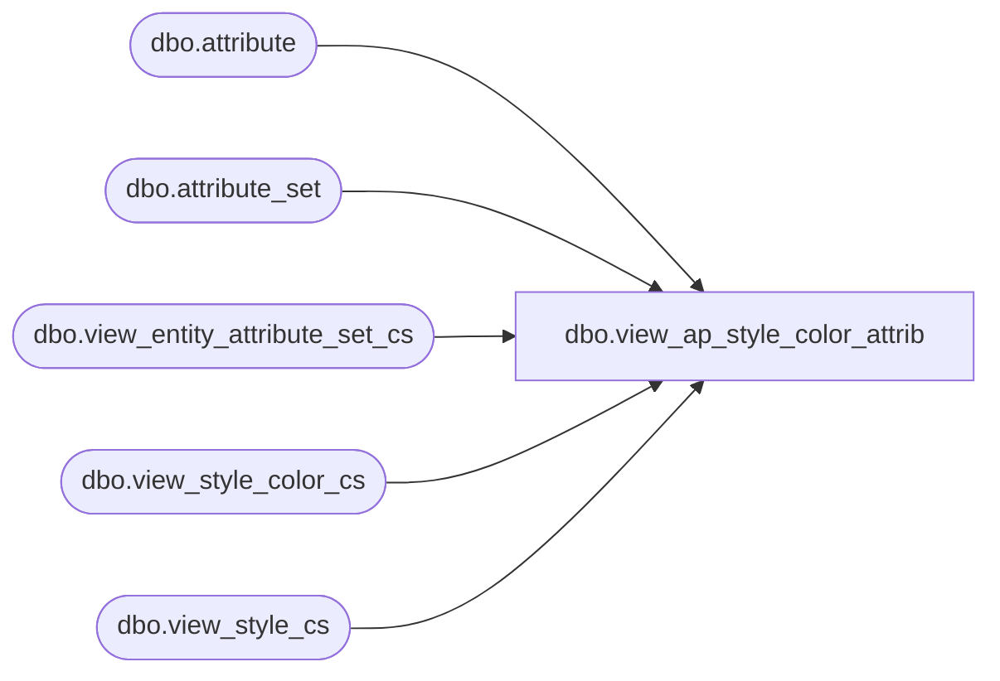

# dbo.view_ap_style_color_attrib

**Database:** me_01  
**Server:** bedrockdb02  

## Architecture Diagram



## Table Dependencies

| Referenced Table |
|---|
| dbo.attribute |
| dbo.attribute_set |
| dbo.view_entity_attribute_set_cs |
| dbo.view_style_color_cs |
| dbo.view_style_cs |

## View Code

```sql
create view [dbo].[view_ap_style_color_attrib] as
select s.style_id, style_color_id, attribute_code, attribute_label, attribute_set_code, attribute_set_label
from view_style_cs s
	left outer join view_style_color_cs sc on s.style_id = sc.style_id
	left outer join view_entity_attribute_set_cs sa
		inner join attribute a on (sa.attribute_id = a.attribute_id)
		inner join attribute_set ats on (sa.attribute_set_id = ats.attribute_set_id)
	on sa.parent_type = 19 and sa.parent_id = sc.style_color_id

dbo,view_ap_style_home_retail,create view [dbo].[view_ap_style_home_retail] as
select s.style_id,
sr.compare_at_retail,
sr.original_valuation_retail,
sr.original_selling_retail,
sr.original_price_status_id,
ops.price_status_desc as orig_price_status_desc,
sr.current_valuation_retail,
sr.current_selling_retail,
sr.current_price_status_id, 
cps.price_status_desc as curr_price_status_desc
from view_style_cs s
left outer join view_style_retail_cs sr inner join jurisdiction j 
                                           on (j.jurisdiction_id = sr.jurisdiction_id
                                           and j.home_jurisdiction_flag =1)
on sr.style_id = s.style_id
left outer join price_status ops
on ops.price_status_id = sr.original_price_status_id
left outer join price_status cps
on cps.price_status_id = sr.current_price_status_id

dbo,view_ap_style_main_merch_grp,create view [dbo].[view_ap_style_main_merch_grp] as
select 
s.style_id,
sg.hierarchy_group_id,
hierarchy_group_code,
hierarchy_group_label,
hierarchy_group_short_label,
reclass_pending_flag,
reclass_to_group_id,
reclass_move_history_flag
from view_style_cs s
left outer join view_style_group_cs sg
    inner join hierarchy_group hg on (hg.hierarchy_group_id = sg.hierarchy_group_id)
on s.style_id = sg.style_id
and main_group_flag =1

dbo,view_ap_style_position,create view [dbo].[view_ap_style_position] as 
select s.style_id,s.position_id,position_label
from view_style_cs s
left outer join position p
on p.position_id = s.position_id
```

