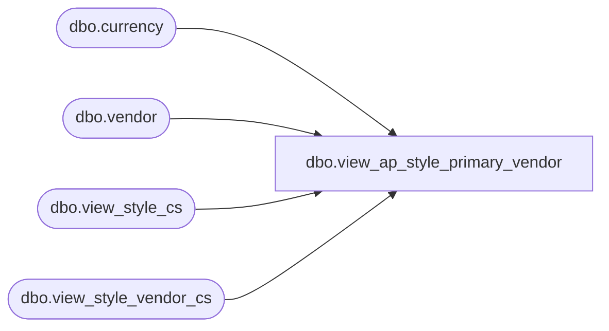

# dbo.view_ap_style_primary_vendor

**Database:** me_01  
**Server:** bedrockdb02  

## Architecture Diagram



## Table Dependencies

| Referenced Table |
|---|
| dbo.currency |
| dbo.vendor |
| dbo.view_style_cs |
| dbo.view_style_vendor_cs |

## View Code

```sql
create view [dbo].[view_ap_style_primary_vendor] as
select s.style_id , sv.vendor_id,
 vendor_style , current_cost,
 sv.currency_id, c.currency_code,  vendor_code, vendor_name, alternate_vendor_code
from  view_style_cs s 
left outer join view_style_vendor_cs sv
on s.style_id = sv.style_id
and sv.primary_vendor_flag =1
left outer join currency c
on sv.currency_id = c.currency_id
left outer join vendor v
on sv.vendor_id = v.vendor_id

dbo,view_ap_style_season,create view [dbo].[view_ap_style_season] as select style_id, season_code, season_description
from view_style_cs s
left outer join season ss
on s.season_id = ss.season_id

dbo,view_ap_style_size_category,create view [dbo].[view_ap_style_size_category] as 
select style_id, size_category_code, size_category_label, number_of_dimensions
from view_style_cs s
left outer join  size_category sc
on s.size_category_id = sc.size_category_id
dbo,view_ap_style_ticket_format,create view [dbo].[view_ap_style_ticket_format] AS 
SELECT style_id, ticket_format_code, ticket_format_description
from view_style_cs s
left outer join ticket_format tf
on s.ticket_format_id = tf.ticket_format_id

dbo,view_ap_style_year,create view [dbo].[view_ap_style_year] as select style_id, calendar_year_code
from view_style_cs s
left outer join calendar_year c
on s.calendar_year_id = c.calendar_year_id
```

