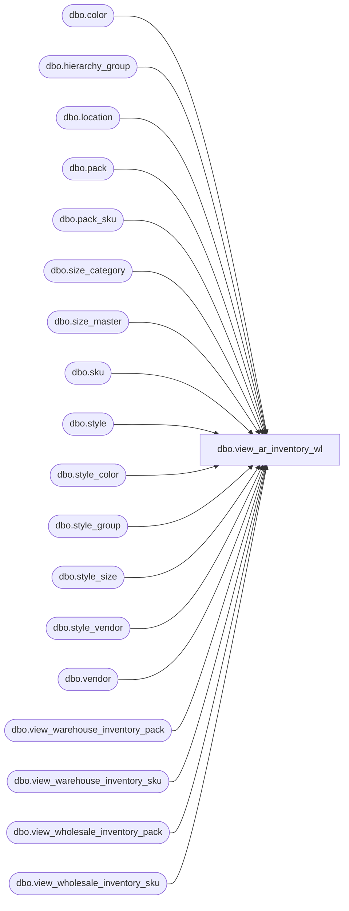

# dbo.view_ar_inventory_wl

**Database:** me_01  
**Server:** bedrockdb02  

## Architecture Diagram



## Table Dependencies

| Referenced Table |
|---|
| dbo.color |
| dbo.hierarchy_group |
| dbo.location |
| dbo.pack |
| dbo.pack_sku |
| dbo.size_category |
| dbo.size_master |
| dbo.sku |
| dbo.style |
| dbo.style_color |
| dbo.style_group |
| dbo.style_size |
| dbo.style_vendor |
| dbo.vendor |
| dbo.view_warehouse_inventory_pack |
| dbo.view_warehouse_inventory_sku |
| dbo.view_wholesale_inventory_pack |
| dbo.view_wholesale_inventory_sku |

## View Code

```sql
CREATE VIEW [dbo].[view_ar_inventory_wl]
AS

-- SELECT * FROM view_warehouse_inventory_sku
-- document source = 0 ->Warehouse
SELECT 	wainvsku.location_id as distribute_from_location_id,
		wainvsku.location_code as distribute_from_location_code,
		l.location_name as distribute_from_location_name,
		NULL as wholesale_vendor_id,
		N' ' as wholesale_vendor_code,
		N' ' as wholesale_vendor_name,
		0 as document_source,
		wainvsku.available_on_hand,
		hg.hierarchy_group_code,
		hg.hierarchy_group_label,
		s.style_id,
		wainvsku.style_code,
		s.short_desc as style_short_desc,
		c.color_id,
		wainvsku.color_code,
		sc.style_color_id,
		sc.long_desc as style_color_long_desc,
		sc.reorder_flag as style_color_reorderable_flag,
		NULL as pack_id,
		N' ' as pack_code,
		N' ' as pack_description,
		scat.size_category_code,
		sm.prim_seq_no,
		sm.sec_seq_no,
		wainvsku.size_code,
		wainvsku.sku_id,
		sv.vendor_id as style_main_vendor_id,
		v.vendor_code as style_main_vendor_code,
		v.vendor_name as style_main_vendor_name
FROM    view_warehouse_inventory_sku wainvsku
		LEFT OUTER JOIN location l  ON (wainvsku.location_id = l.location_id)
		LEFT OUTER JOIN (sku k
				INNER JOIN style_group sg ON sg.main_group_flag = 1 AND k.style_id = sg.style_id
				INNER JOIN hierarchy_group hg ON sg.hierarchy_group_id = hg.hierarchy_group_id
				INNER JOIN style s ON k.style_id = s.style_id
				INNER JOIN style_color sc ON k.style_color_id = sc.style_color_id
				INNER JOIN color c ON sc.color_id = c.color_id
				INNER JOIN style_size ss ON k.style_size_id = ss.style_size_id
				INNER JOIN size_master sm ON ss.size_master_id = sm.size_master_id
				INNER JOIN size_category scat ON sm.size_category_id = scat.size_category_id
				INNER JOIN style_vendor sv ON sv.primary_vendor_flag = 1 AND s.style_id = sv.style_id
				INNER JOIN vendor v ON sv.vendor_id = v.vendor_id
			) ON wainvsku.sku_id = k.sku_id
WHERE    wainvsku.available_on_hand > 0

UNION ALL

-- SELECT * FROM view_warehouse_inventory_pack
-- document source = 0 ->Warehouse
SELECT  wainvpk.location_id as distribute_from_location_id,
		wainvpk.location_code as distribute_from_location_code,
		l.location_name as distribute_from_location_name,
		NULL as wholesale_vendor_id,
		N' ' as wholesale_vendor_code,
		N' ' as wholesale_vendor_name,
		0 as document_source,
 		wainvpk.available_on_hand,
		hg.hierarchy_group_code,
		hg.hierarchy_group_label,
		pk.style_id,
		s.style_code,
		s.short_desc as style_short_desc,
		ISNULL(pkscc.color_id, -1) as color_id,
		ISNULL(pkscc.color_code, '*') as color_code,
		ISNULL(pkscc.style_color_id, -1) as style_color_id,
		ISNULL(pkscc.long_desc, N' ') as style_color_long_desc,
		ISNULL(pkscc.reorder_flag, 0) as style_color_reorderable_flag,
		wainvpk.pack_id,
		wainvpk.pack_code,
		pk.pack_description,
		pkscat.size_category_code,
		NULL as prim_seq_no,
		NULL as sec_seq_no,
		NULL as size_code,
		NULL as sku_id,
		sv.vendor_id as style_main_vendor_id,
		v.vendor_code as style_main_vendor_code,
		v.vendor_name as style_main_vendor_name
FROM    view_warehouse_inventory_pack wainvpk
		LEFT OUTER JOIN location l  ON (wainvpk.location_id = l.location_id)
		LEFT OUTER JOIN (pack pk
				INNER JOIN style_group sg ON sg.main_group_flag = 1 AND pk.style_id = sg.style_id
				INNER JOIN hierarchy_group hg ON sg.hierarchy_group_id = hg.hierarchy_group_id
				INNER JOIN style s ON pk.style_id = s.style_id
				INNER JOIN style_vendor sv ON sv.primary_vendor_flag = 1 AND s.style_id = sv.style_id
				INNER JOIN vendor v ON sv.vendor_id = v.vendor_id
			) ON (wainvpk.pack_id = pk.pack_id)
		LEFT JOIN
		(
			SELECT pk.pack_id, sc.style_color_id, sc.long_desc, sc.reorder_flag, c.color_id, c.color_code
			FROM pack_sku pksk
				INNER JOIN pack pk ON pk.pack_id = pksk.pack_id
				INNER JOIN sku sk ON sk.sku_id = pksk.sku_id
				INNER JOIN style_color sc ON sc.style_color_id = sk.style_color_id
				INNER JOIN color c ON c.color_id = sc.color_id
			WHERE pk.multi_color_flag = 0
			GROUP BY pk.pack_id, sc.style_color_id, sc.long_desc, sc.reorder_flag, c.color_id, c.color_code
		) pkscc ON wainvpk.pack_id = pkscc.pack_id
		LEFT JOIN
		(
			SELECT pk.pack_id, scat.size_category_code
			FROM pack pk
				INNER JOIN pack_sku pksk ON pk.pack_id = pksk.pack_id
				INNER JOIN sku sk ON pksk.sku_id = sk.sku_id
				INNER JOIN style_size ss ON sk.style_size_id = ss.style_size_id
				INNER JOIN size_master sm ON ss.size_master_id = sm.size_master_id
				INNER JOIN size_category scat ON sm.size_category_id = scat.size_category_id
			GROUP BY pk.pack_id, scat.size_category_code
		) pkscat ON wainvpk.pack_id = pkscat.pack_id
WHERE    wainvpk.available_on_hand > 0

UNION ALL

-- SELECT * FROM view_wholesale_inventory_sku
-- document source = 3->Wholesale
SELECT 	NULL as distribute_from_location_id,
		N' ' as distribute_from_location_code,
		N' ' as distribute_from_location_name,
		whinvsku.vendor_id as wholesale_vendor_id,
		v.vendor_code as wholesale_vendor_code,
		v.vendor_name as wholesale_vendor_name,
		3 as document_source,
		whinvsku.available_on_hand,
		hg.hierarchy_group_code,
		hg.hierarchy_group_label,
		s.style_id,
		whinvsku.style_code,
		s.short_desc as style_short_desc,
		c.color_id,
		whinvsku.color_code,
		sc.style_color_id,
		sc.long_desc as style_color_long_desc,
		sc.reorder_flag as style_color_reorderable_flag,
		NULL as pack_id,
		N' ' as pack_code,
		N' ' as pack_description,
		scat.size_category_code,
		sm.prim_seq_no,
		sm.sec_seq_no,
		whinvsku.size_code,
		whinvsku.sku_id,
		whinvsku.vendor_id as style_main_vendor_id,
		v.vendor_code as style_main_vendor_code,
		v.vendor_name as style_main_vendor_name
FROM    view_wholesale_inventory_sku whinvsku
		LEFT OUTER JOIN vendor v  ON (whinvsku.vendor_id = v.vendor_id)
		LEFT OUTER JOIN (sku k
				INNER JOIN style_group sg ON sg.main_group_flag = 1 AND k.style_id = sg.style_id
				INNER JOIN hierarchy_group hg ON sg.hierarchy_group_id = hg.hierarchy_group_id
				INNER JOIN style s ON k.style_id = s.style_id
				INNER JOIN style_color sc ON k.style_color_id = sc.style_color_id
				INNER JOIN color c ON sc.color_id = c.color_id
				INNER JOIN style_size ss ON k.style_size_id = ss.style_size_id
				INNER JOIN size_master sm ON ss.size_master_id = sm.size_master_id
				INNER JOIN size_category scat ON sm.size_category_id = scat.size_category_id
			) ON (whinvsku.sku_id = k.sku_id)
WHERE    whinvsku.available_on_hand > 0

UNION ALL

-- SELECT * FROM view_wholesale_inventory_pack
-- document source = 3->Wholesale
SELECT 	NULL as distribute_from_location_id,
		N' ' as distribute_from_location_code,
		N' ' as distribute_from_location_name,
		whinvpk.vendor_id as wholesale_vendor_id,
		v.vendor_code as wholesale_vendor_code,
		v.vendor_name as wholesale_vendor_name,
		3 as document_source,
 		whinvpk.available_on_hand,
		hg.hierarchy_group_code,
		hg.hierarchy_group_label,
		s.style_id,
		s.style_code,
		s.short_desc as style_short_desc,
		ISNULL(pkscc.color_id, -1) as color_id,
		ISNULL(pkscc.color_code, '*') as color_code,
		ISNULL(pkscc.style_color_id, -1) as style_color_id,
		ISNULL(pkscc.long_desc, N' ') as style_color_long_desc,
		ISNULL(pkscc.reorder_flag, 0) as style_color_reorderable_flag,
		whinvpk.pack_id,
		whinvpk.pack_code,
		pk.pack_description,
		pkscat.size_category_code,
		NULL as prim_seq_no,
		NULL as sec_seq_no,
		NULL as size_code,
		NULL as sku_id,
		whinvpk.vendor_id as style_main_vendor_id,
		v.vendor_code as style_main_vendor_code,
		v.vendor_name as style_main_vendor_name
FROM    view_wholesale_inventory_pack whinvpk
		LEFT OUTER JOIN vendor v  ON whinvpk.vendor_id = v.vendor_id
		LEFT OUTER JOIN (pack pk
				INNER JOIN style_group sg ON sg.main_group_flag = 1 AND pk.style_id = sg.style_id
				INNER JOIN hierarchy_group hg ON sg.hierarchy_group_id = hg.hierarchy_group_id
				INNER JOIN style s ON pk.style_id = s.style_id
			) ON whinvpk.pack_id = pk.pack_id
		LEFT JOIN
		(
			SELECT pk.pack_id, sc.style_color_id, sc.long_desc, sc.reorder_flag, c.color_id, c.color_code
			FROM pack_sku pksk
				INNER JOIN pack pk ON pk.pack_id = pksk.pack_id
				INNER JOIN sku sk ON sk.sku_id = pksk.sku_id
				INNER JOIN style_color sc ON sc.style_color_id = sk.style_color_id
				INNER JOIN color c ON c.color_id = sc.color_id
			WHERE pk.multi_color_flag = 0
			GROUP BY pk.pack_id, sc.style_color_id, sc.long_desc, sc.reorder_flag, c.color_id, c.color_code
		) pkscc ON whinvpk.pack_id = pkscc.pack_id
		LEFT JOIN
		(
			SELECT pk.pack_id, scat.size_category_code
			FROM pack pk
				INNER JOIN pack_sku pksk ON pk.pack_id = pksk.pack_id
				INNER JOIN sku sk ON pksk.sku_id = sk.sku_id
				INNER JOIN style_size ss ON sk.style_size_id = ss.style_size_id
				INNER JOIN size_master sm ON ss.size_master_id = sm.size_master_id
				INNER JOIN size_category scat ON sm.size_category_id = scat.size_category_id
			GROUP BY pk.pack_id, scat.size_category_code
		) pkscat ON whinvpk.pack_id = pkscat.pack_id
WHERE    whinvpk.available_on_hand > 0
```

