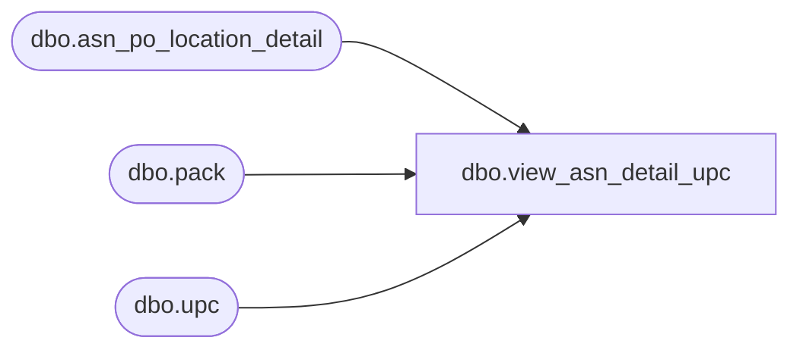

# dbo.view_asn_detail_upc

**Database:** me_01  
**Server:** bedrockdb02  

## Architecture Diagram



## Table Dependencies

| Referenced Table |
|---|
| dbo.asn_po_location_detail |
| dbo.pack |
| dbo.upc |

## View Code

```sql
CREATE VIEW dbo.view_asn_detail_upc
AS

SELECT 	DISTINCT
		apd.advance_shipping_notice_id,
		apd.asn_po_location_detail_id,
		u.upc_id,
		u.upc_number,
		u.upc_type
FROM	asn_po_location_detail apd
		LEFT OUTER JOIN upc u ON (apd.sku_id = u.sku_id)
WHERE 	apd.sku_id IS NOT NULL AND apd.pack_id IS NULL 
UNION
SELECT 	DISTINCT
		apd.advance_shipping_notice_id,
		apd.asn_po_location_detail_id,
		upcs.upc_id,
		upcs.upc_number,
		upcs.upc_type
FROM	asn_po_location_detail apd
		LEFT OUTER JOIN (SELECT p.pack_id, 
								u.upc_id, 
								u.upc_number,
								u.upc_type
						FROM	pack p
								INNER JOIN upc u
								ON (p.pack_id = u.pack_id)) upcs
		ON (apd.pack_id = upcs.pack_id)
WHERE 	apd.pack_id IS NOT NULL
```

