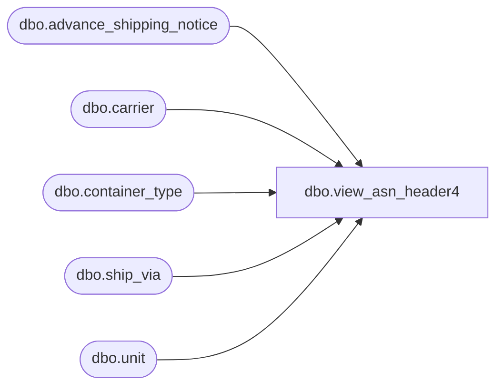

# dbo.view_asn_header4

**Database:** me_01  
**Server:** bedrockdb02  

## Architecture Diagram



## Table Dependencies

| Referenced Table |
|---|
| dbo.advance_shipping_notice |
| dbo.carrier |
| dbo.container_type |
| dbo.ship_via |
| dbo.unit |

## View Code

```sql
CREATE VIEW dbo.view_asn_header4
AS
SELECT 	DISTINCT
	asn.advance_shipping_notice_id,
	ct.container_type_id,
	ct.container_type_code,
	ct.container_type_label,
	u.unit_id unit_weight_id,
	u.unit_code,
	u.unit_label,
	c.carrier_id,
	c.carrier_code,
	c.carrier_name,
	sv.ship_via_id,
	sv.ship_via_code,
	sv.ship_via_description
FROM	advance_shipping_notice asn
LEFT OUTER JOIN container_type ct ON (asn.container_type_id = ct.container_type_id)
LEFT OUTER JOIN unit u ON (asn.unit_weight_id = u.unit_id and u.unit_type_id = 2)
LEFT OUTER JOIN carrier c ON (asn.carrier_id = c.carrier_id)
LEFT OUTER JOIN ship_via sv ON (asn.ship_via_id = sv.ship_via_id)
```

