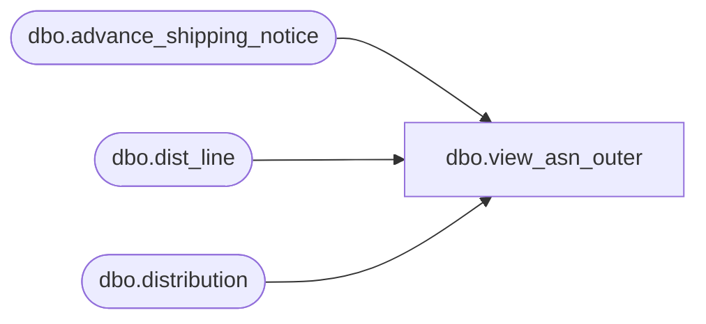

# dbo.view_asn_outer

**Database:** me_01  
**Server:** bedrockdb02  

## Architecture Diagram



## Table Dependencies

| Referenced Table |
|---|
| dbo.advance_shipping_notice |
| dbo.dist_line |
| dbo.distribution |

## View Code

```sql
create view dbo.view_asn_outer 


 AS
SELECT DISTINCT 
 d.distribution_id,
 a.advance_shipping_notice_id,
 a.document_no,
 a.expected_receipt_date,
 a.shipment_ref_no
FROM distribution d 
INNER JOIN dist_line dl
ON d.distribution_id = dl.distribution_id 
LEFT OUTER JOIN advance_shipping_notice a 
ON dl.advance_shipping_notice_id = a.advance_shipping_notice_id
```

