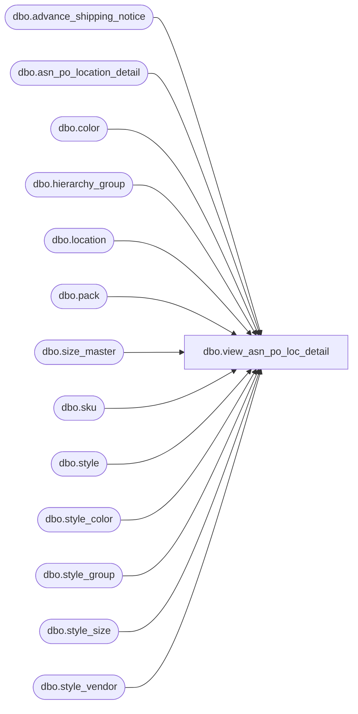

# dbo.view_asn_po_loc_detail

**Database:** me_01  
**Server:** bedrockdb02  

## Architecture Diagram



## Table Dependencies

| Referenced Table |
|---|
| dbo.advance_shipping_notice |
| dbo.asn_po_location_detail |
| dbo.color |
| dbo.hierarchy_group |
| dbo.location |
| dbo.pack |
| dbo.size_master |
| dbo.sku |
| dbo.style |
| dbo.style_color |
| dbo.style_group |
| dbo.style_size |
| dbo.style_vendor |

## View Code

```sql
CREATE VIEW dbo.view_asn_po_loc_detail
AS
SELECT 	DISTINCT 
		asn.advance_shipping_notice_id,
		COALESCE(apd.asn_po_location_detail_id, 0) AS asn_po_location_detail_id,
		COALESCE(apd.carton_no, N'') AS carton_no,
		s.style_id,
		s.style_code, 
		s.long_desc,
		s.short_desc, 
		c.color_code, 
		c.color_long_description,
		c.color_short_description,
		sm.size_code,
		apd.units_sent,
	 	COALESCE(sv.vendor_style, N'') AS vendor_style,
		NULL vendor_pack_code,
		Null pack_id,
		NULL pack_code,
		NULL pack_description,
		NULL pack_short_description,
		h.hierarchy_group_id, 
		h.hierarchy_group_code,
		h.hierarchy_group_short_label, 
		h.hierarchy_group_label,
		COALESCE(apd.location_id, 0) AS selling_location_id, 
		COALESCE(l.location_code, N'') AS selling_location_code, 
		COALESCE(l.location_name, N'') AS selling_location_name
FROM	advance_shipping_notice asn
		LEFT OUTER JOIN asn_po_location_detail apd ON (asn.advance_shipping_notice_id = apd.advance_shipping_notice_id)
		LEFT OUTER JOIN style s ON (apd.style_id = s.style_id)
		LEFT OUTER JOIN style_color sc ON (sc.style_id = s.style_id AND sc.style_color_id = apd.style_color_id)
		LEFT OUTER JOIN color c ON (sc.color_id = c.color_id)
		LEFT OUTER JOIN sku ON (apd.sku_id = sku.sku_id AND s.style_id = sku.style_id AND sc.style_color_id = sku.style_color_id)
		LEFT OUTER JOIN style_size sz ON (s.style_id = sz.style_id AND sku.style_size_id = sz.style_size_id)
		LEFT OUTER JOIN size_master sm ON (sm.size_master_id = sz.size_master_id)
		LEFT OUTER JOIN style_vendor sv ON (sc.style_id = sv.style_id AND sv.vendor_id = asn.vendor_id)
		LEFT OUTER JOIN style_group sg ON (sc.style_id = sg.style_id AND sg.main_group_flag = 1)
		LEFT OUTER JOIN hierarchy_group h ON (sg.hierarchy_group_id = h.hierarchy_group_id)
		LEFT OUTER JOIN location l ON (apd.location_id = l.location_id)
WHERE 	apd.sku_id IS NOT NULL AND apd.pack_id IS NULL
UNION
SELECT 	DISTINCT 
		asn.advance_shipping_notice_id,
		COALESCE(apd.asn_po_location_detail_id, 0) AS asn_po_location_detail_id,
		COALESCE(apd.carton_no, N'') AS carton_no,
		s.style_id,
		s.style_code, 
		s.long_desc,
		s.short_desc, 
		NULL AS color_code, 
		NULL AS  color_long_description,
		NULL AS color_short_description,
		NULL AS size_code,
		apd.units_sent,
		NULL vendor_style,
	 	COALESCE(p.vendor_pack_code, N'') AS vendor_pack_code,
		p.pack_id,
		p.pack_code,
		p.pack_description,
		p.pack_short_description,
		h.hierarchy_group_id, 
		h.hierarchy_group_code,
		h.hierarchy_group_short_label, 
		h.hierarchy_group_label,
		COALESCE(apd.location_id, 0) AS selling_location_id, 
		COALESCE(l.location_code, N'') AS selling_location_code, 
		COALESCE(l.location_name, N'') AS selling_location_name
FROM	advance_shipping_notice asn
		LEFT OUTER JOIN asn_po_location_detail apd ON (asn.advance_shipping_notice_id = apd.advance_shipping_notice_id)
		LEFT OUTER JOIN pack p ON (apd.pack_id = p.pack_id AND apd.style_id = p.style_id)
		INNER JOIN style s ON (p.style_id = s.style_id)
		LEFT OUTER JOIN style_group sg ON (s.style_id = sg.style_id AND sg.main_group_flag = 1)
		LEFT OUTER JOIN hierarchy_group h ON (sg.hierarchy_group_id = h.hierarchy_group_id)
		LEFT OUTER JOIN location l ON (apd.location_id = l.location_id)
WHERE 	apd.pack_id IS NOT NULL
```

