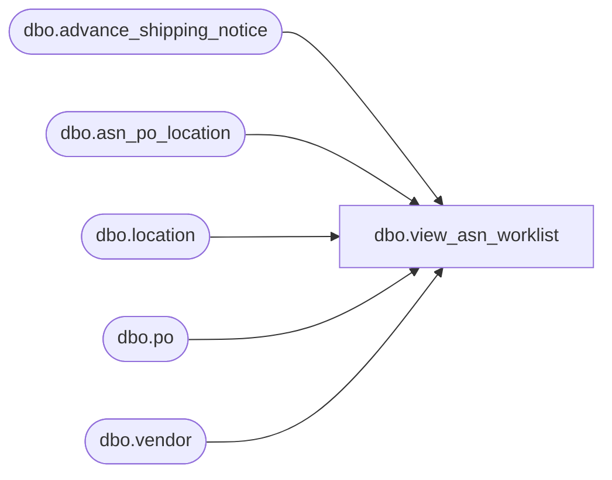

# dbo.view_asn_worklist

**Database:** me_01  
**Server:** bedrockdb02  

## Architecture Diagram



## Table Dependencies

| Referenced Table |
|---|
| dbo.advance_shipping_notice |
| dbo.asn_po_location |
| dbo.location |
| dbo.po |
| dbo.vendor |

## View Code

```sql
CREATE VIEW dbo.view_asn_worklist
AS
SELECT DISTINCT a.advance_shipping_notice_id,
		a.document_no,
		a.create_date,
		a.asn_status,
		a.expected_receipt_date,
		a.last_activity_date,
		a.ship_date,
		COALESCE(a.pro_bill_no, N'') AS pro_bill_no,
		COALESCE(a.bill_of_lading, N'') AS bill_of_lading,
		COALESCE(a.unit_weight_id, 0) AS unit_weight_id,
		COALESCE(a.container_type_id, 0) AS container_type_id,
		COALESCE(a.carrier_id, 0) AS carrier_id,
		COALESCE(a.ship_via_id, 0) AS ship_via_id,
		COALESCE(a.weight, 0) AS weight,
		COALESCE(a.no_of_containers, 0) AS no_of_containers,
		a.vendor_id,
		v.vendor_code,
		v.vendor_name,
		a.shipment_ref_no,
		apl.po_id,
		p.po_no,
		COALESCE(apl.blanket_po_id, 0) AS blanket_po_id,
		COALESCE(p.blanket_po_number, N'') AS blanket_po_number,
		COALESCE(p.release_number, 0) AS release_number,
		apl.location_id,
		l.location_code,
		l.location_name,
		apl.ticket_status,
		apl.ticket_source
FROM advance_shipping_notice a, vendor v, asn_po_location apl, po p, location l
WHERE a.vendor_id = v.vendor_id
AND a.advance_shipping_notice_id = apl.advance_shipping_notice_id
AND apl.po_id = p.po_id
AND apl.location_id = l.location_id
```

