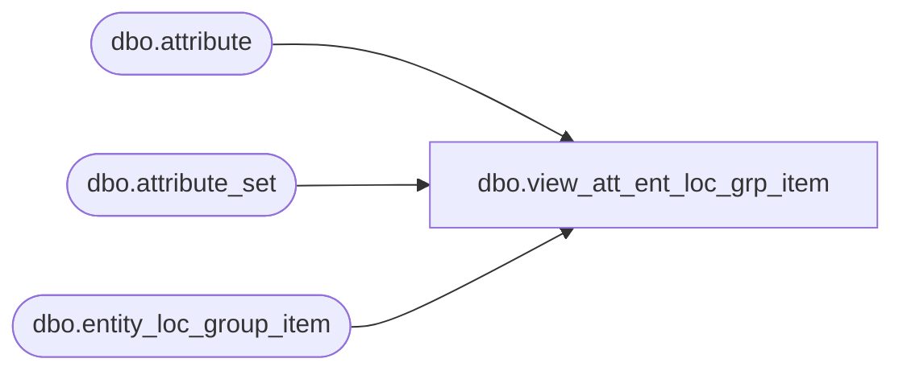

# dbo.view_att_ent_loc_grp_item

**Database:** me_01  
**Server:** bedrockdb02  

## Architecture Diagram



## Table Dependencies

| Referenced Table |
|---|
| dbo.attribute |
| dbo.attribute_set |
| dbo.entity_loc_group_item |

## View Code

```sql
CREATE VIEW dbo.view_att_ent_loc_grp_item  
AS

SELECT DISTINCT
i.entity_loc_group_id,
a.attribute_id,
a.attribute_code,
a.attribute_label,
t.attribute_set_id,
t.attribute_set_code,
t.attribute_set_label
FROM attribute a
INNER JOIN attribute_set t
ON a.attribute_id = t.attribute_id
INNER JOIN entity_loc_group_item i ON i.attribute_id = a.attribute_id AND i.attribute_set_id = t.attribute_set_id
```

