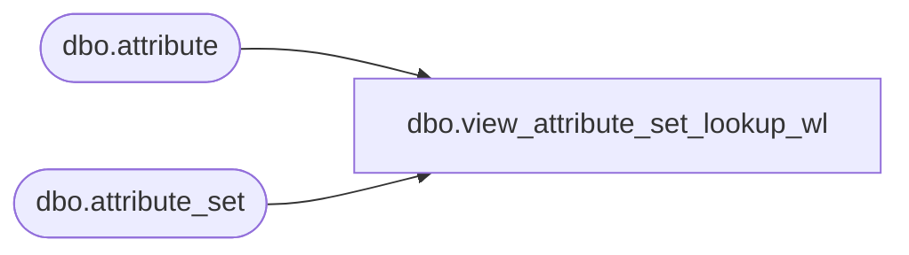

# dbo.view_attribute_set_lookup_wl

**Database:** me_01  
**Server:** bedrockdb02  

## Architecture Diagram



## Table Dependencies

| Referenced Table |
|---|
| dbo.attribute |
| dbo.attribute_set |

## View Code

```sql
create view dbo.view_attribute_set_lookup_wl 

AS
SELECT att.parent_type, att.attribute_label + N' - ' + ats.attribute_set_label 'attribute_set_label', attribute_set_code, attribute_set_id
FROM attribute_set ats
INNER JOIN attribute att ON (ats.attribute_id = att.attribute_id)
WHERE ats.active_flag = 1
AND att.active_flag = 1
```

