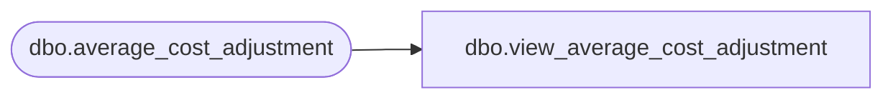

# dbo.view_average_cost_adjustment

**Database:** me_01  
**Server:** bedrockdb02  

## Architecture Diagram



## Table Dependencies

| Referenced Table |
|---|
| dbo.average_cost_adjustment |

## View Code

```sql
create view dbo.view_average_cost_adjustment 	(doc_type,
	doc_no,
	create_date,
	status,
	doc_id,
	grouping_label,
	transaction_reason_id,
	performed_by)
AS
SELECT N'Average cost adjustment',
	document_no,
   	convert(smalldatetime,convert(char(12),create_date,109)),
	document_status,
	average_cost_adjustment_id,
	grouping_label,
	CAST(null AS smallint),
	performed_by
FROM average_cost_adjustment
```

