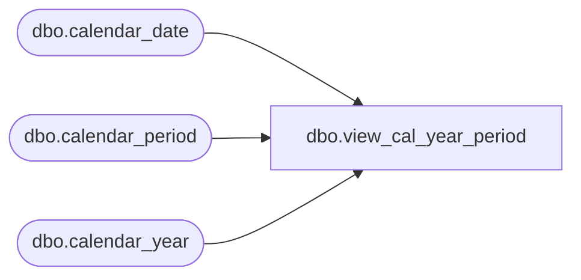

# dbo.view_cal_year_period

**Database:** me_01  
**Server:** bedrockdb02  

## Architecture Diagram



## Table Dependencies

| Referenced Table |
|---|
| dbo.calendar_date |
| dbo.calendar_period |
| dbo.calendar_year |

## View Code

```sql
create view dbo.view_cal_year_period 
    (calendar_period_id, cal_year_code, cal_period_code, cal_year_period_code, 
    current_year, current_year_pd) 
AS 
SELECT 
   cp.calendar_period_id,   
   cy.calendar_year_code cal_year_code,   
   cp.calendar_period_code cal_period_code,  
  (cy.calendar_year_code *100) + cp.calendar_period_code cal_year_period_code,
   cd.merch_year current_year ,
	(cd.merch_year * 100) + cd.merch_period current_year_pd  
FROM calendar_period cp, calendar_year cy, calendar_date cd   
WHERE cp.calendar_year_id = cy.calendar_year_id 
AND cd.calendar_date = CONVERT(SMALLDATETIME,CONVERT(CHAR(12),GETDATE(),109))
```

