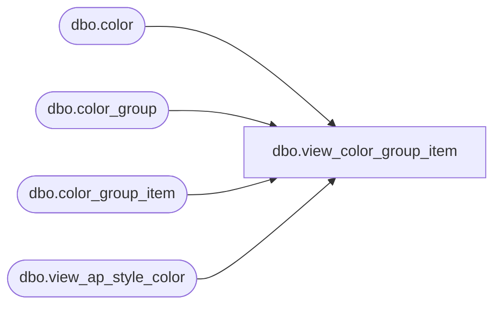

# dbo.view_color_group_item

**Database:** me_01  
**Server:** bedrockdb02  

## Architecture Diagram



## Table Dependencies

| Referenced Table |
|---|
| dbo.color |
| dbo.color_group |
| dbo.color_group_item |
| dbo.view_ap_style_color |

## View Code

```sql
create view dbo.view_color_group_item 
AS
SELECT c.color_id, cg.color_group_id, cg.color_group_code, cg.color_group_description, sc.style_color_id, sc.style_id
FROM color_group_item cgi
RIGHT OUTER JOIN color c on cgi.color_id = c.color_id
LEFT OUTER JOIN color_group cg on cg.color_group_id = cgi.color_group_id
LEFT OUTER JOIN view_ap_style_color sc ON sc.color_id = cgi.color_id
```

