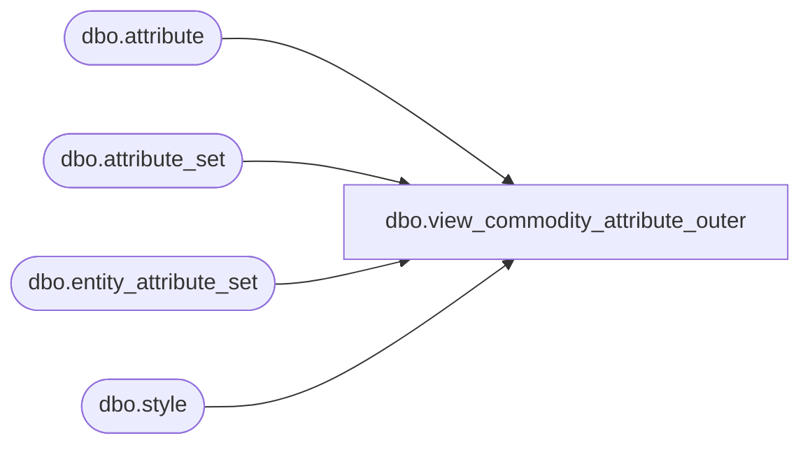

# dbo.view_commodity_attribute_outer

**Database:** me_01  
**Server:** bedrockdb02  

## Architecture Diagram



## Table Dependencies

| Referenced Table |
|---|
| dbo.attribute |
| dbo.attribute_set |
| dbo.entity_attribute_set |
| dbo.style |

## View Code

```sql
create view dbo.view_commodity_attribute_outer AS
SELECT DISTINCT 
  s.style_id ,
 (a.attribute_code + ats.attribute_set_code) commodity_code
FROM style s
LEFT OUTER JOIN (select e.parent_id, e.attribute_id, e.attribute_set_id from entity_attribute_set e
where parent_type = 1 and attribute_id in 
(select attribute_id from attribute where parent_type = 234))e
on s.style_id = e.parent_id
LEFT OUTER JOIN attribute a
ON  e.attribute_id = a.attribute_id and a.parent_type = 234
LEFT OUTER JOIN attribute_set ats
ON ats.attribute_set_id = e.attribute_set_id and ats.attribute_id = a.attribute_id
```

