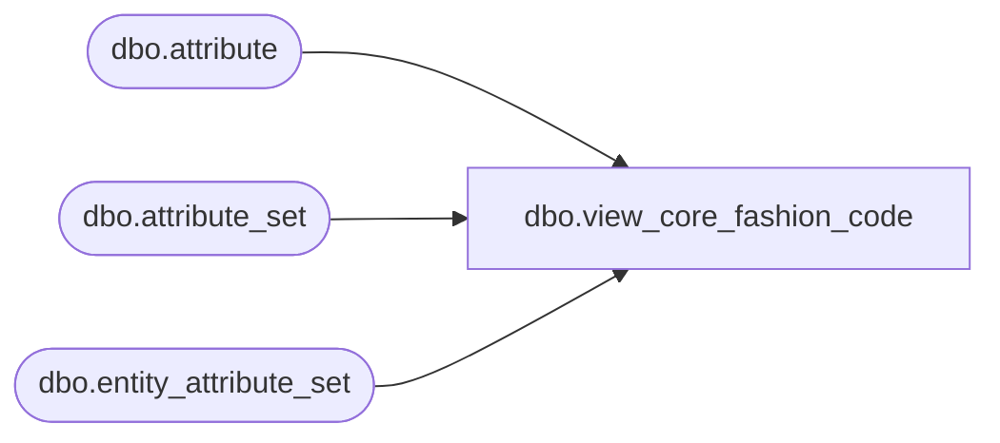

# dbo.view_core_fashion_code

**Database:** me_01  
**Server:** bedrockdb02  

## Architecture Diagram



## Table Dependencies

| Referenced Table |
|---|
| dbo.attribute |
| dbo.attribute_set |
| dbo.entity_attribute_set |

## View Code

```sql
create view [dbo].[view_core_fashion_code] AS

 SELECT eas.parent_id style_id, CAST(min(a.attribute_code) AS VARCHAR(6)) core_fashion_code
  FROM dbo.entity_attribute_set eas with (nolock)
 INNER JOIN dbo.attribute_set ats with (nolock) ON ats.attribute_set_id = eas.attribute_set_id
INNER JOIN dbo.attribute a with (nolock)   ON ats.attribute_id = a.attribute_id
 WHERE (a.attribute_label IN ('FASHION', 'CORE')
   AND eas.parent_type = 1 AND ats.attribute_set_code = 'Y') OR (a.attribute_label IN ('VALUE - UNSTUFFED ANIMALS')
   AND eas.parent_type = 1 AND ats.attribute_set_code = 'VALUE') GROUP BY eas.parent_id
```

