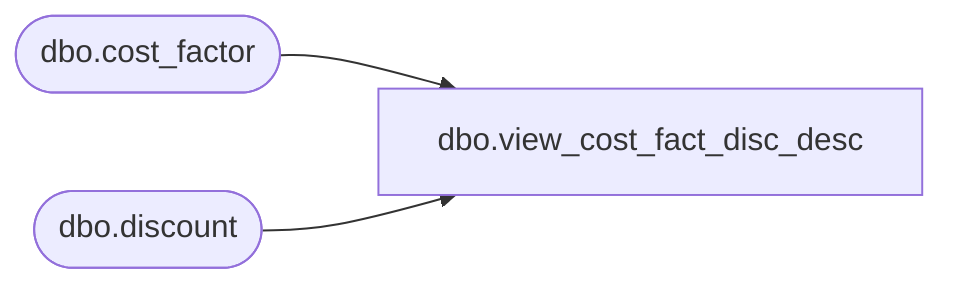

# dbo.view_cost_fact_disc_desc

**Database:** me_01  
**Server:** bedrockdb02  

## Architecture Diagram



## Table Dependencies

| Referenced Table |
|---|
| dbo.cost_factor |
| dbo.discount |

## View Code

```sql
create view dbo.view_cost_fact_disc_desc 
         (transaction_type_code,
          cost_factor_discount_id,
          description)
AS
   SELECT 290,
          cost_factor_id,
          cost_factor_description
     FROM cost_factor
   UNION
   SELECT 292,
          discount_id,
          discount_description
     FROM discount
```

