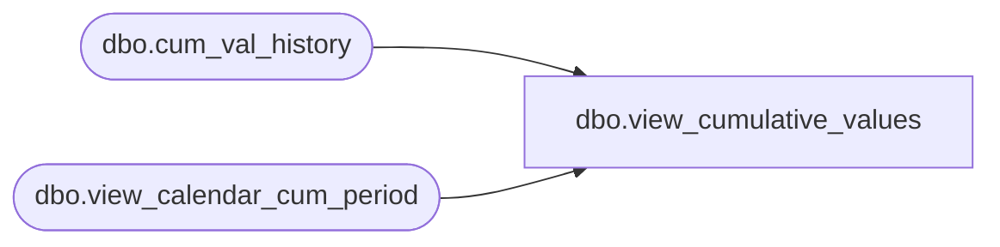

# dbo.view_cumulative_values

**Database:** me_01  
**Server:** bedrockdb02  

## Architecture Diagram



## Table Dependencies

| Referenced Table |
|---|
| dbo.cum_val_history |
| dbo.view_calendar_cum_period |

## View Code

```sql
create view dbo.view_cumulative_values 
   ( hierarchy_group_id, calendar_period_id, location_hierarchy_group_id, jurisdiction_id, cumulative_cost, 
     cumulative_retail, cumulative_cost_local, cumulative_retail_local) 
AS
SELECT merch_hierarchy_group_id hierarchy_group_id,  
        period calendar_period_id, 
        location_hierarchy_group_id,
        jurisdiction_id,
        SUM (cum_val_cost) cumulative_cost, 
        SUM (cum_val_retail) cumulative_retail,
        SUM (cum_val_cost_local) cumulative_cost_local, 
        SUM (cum_val_retail_local) cumulative_retail_local  
FROM cum_val_history cv, view_calendar_cum_period cc  
WHERE cv.calendar_period_id =  cc.cum_period  
GROUP BY  merch_hierarchy_group_id , period, location_hierarchy_group_id, jurisdiction_id
```

