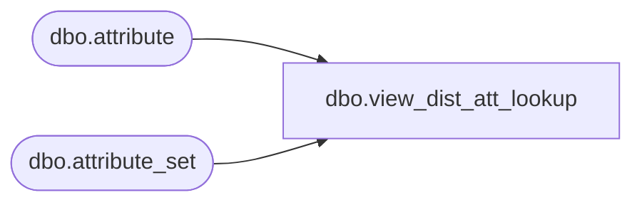

# dbo.view_dist_att_lookup

**Database:** me_01  
**Server:** bedrockdb02  

## Architecture Diagram



## Table Dependencies

| Referenced Table |
|---|
| dbo.attribute |
| dbo.attribute_set |

## View Code

```sql
create view dbo.view_dist_att_lookup as
select distinct a.attribute_set_id, a.attribute_set_code , 
a.attribute_set_label, b.attribute_id , b.attribute_label,b.attribute_code
from attribute_set a, attribute b 
where b.parent_type =229
and a.attribute_id = b.attribute_id
```

