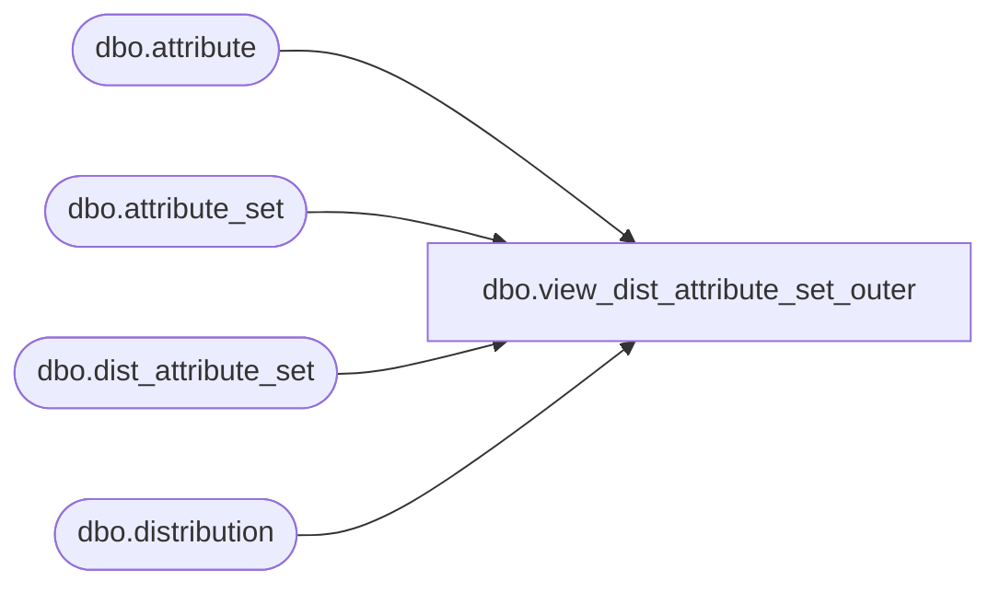

# dbo.view_dist_attribute_set_outer

**Database:** me_01  
**Server:** bedrockdb02  

## Architecture Diagram



## Table Dependencies

| Referenced Table |
|---|
| dbo.attribute |
| dbo.attribute_set |
| dbo.dist_attribute_set |
| dbo.distribution |

## View Code

```sql
create view dbo.view_dist_attribute_set_outer 


AS
SELECT DISTINCT
  a.distribution_id,
  b.attribute_set_id,
  b.attribute_set_code,
  b.attribute_set_label,
  b.attribute_id,
  c.attribute_code,
  c.attribute_label
FROM dist_attribute_set e 
RIGHT JOIN  distribution a
ON a.distribution_id = e.distribution_id
LEFT JOIN attribute_set b
ON e.attribute_set_id = b.attribute_set_id 
LEFT OUTER JOIN attribute c
ON b.attribute_id = c.attribute_id
```

