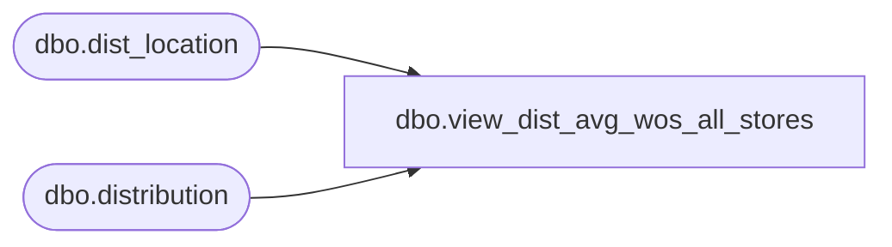

# dbo.view_dist_avg_wos_all_stores

**Database:** me_01  
**Server:** bedrockdb02  

## Architecture Diagram



## Table Dependencies

| Referenced Table |
|---|
| dbo.dist_location |
| dbo.distribution |

## View Code

```sql
create view dbo.view_dist_avg_wos_all_stores AS
SELECT DISTINCT d.distribution_id,
(d.hist_effect_inv_all_stores * ((SELECT MAX(dl.number_weeks_sales) FROM dist_location dl WHERE
d.distribution_id = dl.distribution_id * SIGN(ABS(d.hist_unit_sales_all_stores))) / (d.hist_unit_sales_all_stores+ (1-SIGN(ABS(d.hist_unit_sales_all_stores)))))) average_wos_all_stores
FROM distribution d
```

