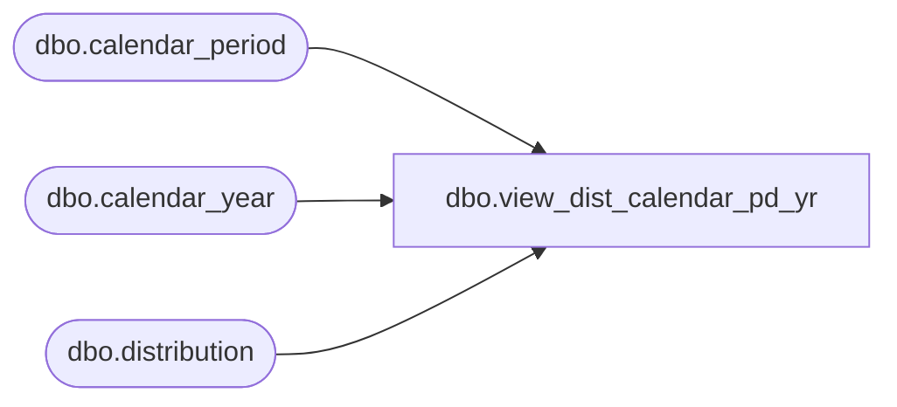

# dbo.view_dist_calendar_pd_yr

**Database:** me_01  
**Server:** bedrockdb02  

## Architecture Diagram



## Table Dependencies

| Referenced Table |
|---|
| dbo.calendar_period |
| dbo.calendar_year |
| dbo.distribution |

## View Code

```sql
create view dbo.view_dist_calendar_pd_yr as
select distinct d.distribution_id, calendar_period_id, calendar_year_code, calendar_period_code, calendar_year_period_code
from
(SELECT 
   cp.calendar_period_id,   
   cy.calendar_year_code calendar_year_code,   
   cp.calendar_period_code calendar_period_code,  
  (cy.calendar_year_code *100) + cp.calendar_period_code calendar_year_period_code  
FROM calendar_period cp, calendar_year cy  
WHERE cp.calendar_year_id = cy.calendar_year_id 
) c
RIGHT JOIN distribution d
on   d.plan_calendar_period_id =c.calendar_period_id
```

