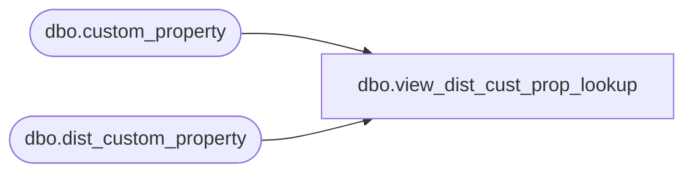

# dbo.view_dist_cust_prop_lookup

**Database:** me_01  
**Server:** bedrockdb02  

## Architecture Diagram



## Table Dependencies

| Referenced Table |
|---|
| dbo.custom_property |
| dbo.dist_custom_property |

## View Code

```sql
create view dbo.view_dist_cust_prop_lookup as
select distinct a.custom_property_id, a.cust_prop_code , 
a.cust_prop_label, a.entity_type , b.custom_property_value
from custom_property a, dist_custom_property b 
where a.entity_type =229
and a.custom_property_id = b.custom_property_id
```

