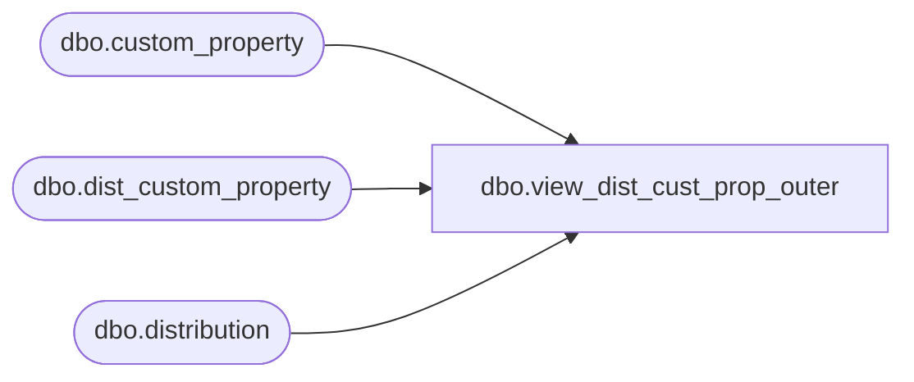

# dbo.view_dist_cust_prop_outer

**Database:** me_01  
**Server:** bedrockdb02  

## Architecture Diagram



## Table Dependencies

| Referenced Table |
|---|
| dbo.custom_property |
| dbo.dist_custom_property |
| dbo.distribution |

## View Code

```sql
create view dbo.view_dist_cust_prop_outer 
AS
SELECT DISTINCT
   a.distribution_id,  
   e.custom_property_value,
   e.custom_property_id,
   b.cust_prop_code,
    b.cust_prop_label   
FROM dist_custom_property  e
RIGHT OUTER JOIN distribution a 
ON a.distribution_id =e.distribution_id 
LEFT OUTER JOIN  custom_property b
ON e.custom_property_id = b.custom_property_id
```

