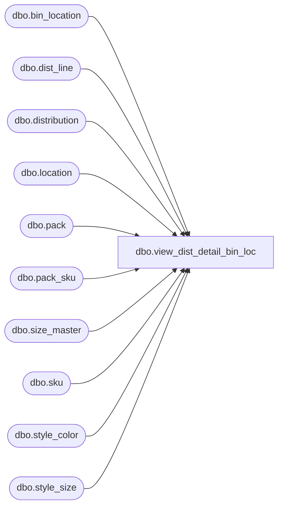

# dbo.view_dist_detail_bin_loc

**Database:** me_01  
**Server:** bedrockdb02  

## Architecture Diagram



## Table Dependencies

| Referenced Table |
|---|
| dbo.bin_location |
| dbo.dist_line |
| dbo.distribution |
| dbo.location |
| dbo.pack |
| dbo.pack_sku |
| dbo.size_master |
| dbo.sku |
| dbo.style_color |
| dbo.style_size |

## View Code

```sql
CREATE view dbo.view_dist_detail_bin_loc
AS 

SELECT 
	DISTINCT 
		d.distribution_id, d.distribution_number,
		k.sku_id, null pack_id, sm.prim_seq_no, COALESCE(sm.sec_seq_no,-1) sec_seq_no, sm.size_code, 
		d.location_id, b.warehouse_code, b.warehouse_name,
		b.bin_location_id, b.bin_type, b.bin_loc_name, COALESCE(b.bin_seq_no, 1) as bin_seq_no
FROM 
	distribution d
LEFT JOIN dist_line dl ON dl.distribution_id = d.distribution_id
LEFT JOIN location l ON l.location_id = d.location_id
LEFT JOIN style_color sc ON dl.style_color_id = sc.style_color_id
LEFT JOIN sku k ON k.style_color_id = dl.style_color_id
LEFT JOIN style_size sz ON k.style_size_id = sz.style_size_id and k.style_id = sz.style_id
LEFT JOIN size_master sm ON sm.size_master_id = sz.size_master_id
LEFT JOIN bin_location b ON l.location_code = b.warehouse_code
AND k.sku_id = b.sku_id and k.style_id = b.style_id AND b.pack_id is null
WHERE dl.pack_id IS NULL
UNION
SELECT 
	DISTINCT 
		d.distribution_id, d.distribution_number,
		k.sku_id, dl.pack_id, sm.prim_seq_no, COALESCE(sm.sec_seq_no,-1) sec_seq_no, sm.size_code, 
		d.location_id, b.warehouse_code, b.warehouse_name,
		b.bin_location_id, b.bin_type, b.bin_loc_name, COALESCE(b.bin_seq_no, 1) as bin_seq_no
FROM distribution d
LEFT JOIN dist_line dl ON dl.distribution_id = d.distribution_id
LEFT JOIN location l ON l.location_id = d.location_id
LEFT JOIN pack p ON p.pack_id = dl.pack_id
LEFT JOIN pack_sku pk ON pk.pack_id = p.pack_id
LEFT JOIN sku k ON k.sku_id = pk.sku_id
LEFT JOIN style_size sz ON k.style_size_id = sz.style_size_id and k.style_id = sz.style_id
LEFT JOIN size_master sm ON sm.size_master_id = sz.size_master_id
LEFT JOIN bin_location b ON l.location_code = b.warehouse_code
AND dl.pack_id = b.pack_id AND b.sku_id is null
WHERE dl.pack_id IS NOT NULL
```

