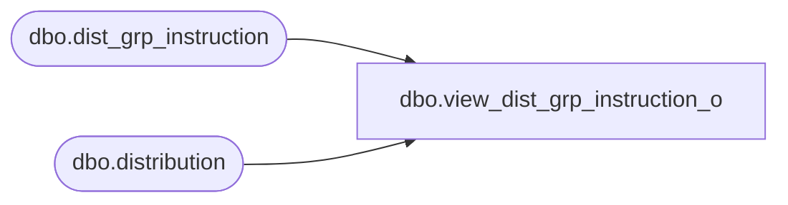

# dbo.view_dist_grp_instruction_o

**Database:** me_01  
**Server:** bedrockdb02  

## Architecture Diagram



## Table Dependencies

| Referenced Table |
|---|
| dbo.dist_grp_instruction |
| dbo.distribution |

## View Code

```sql
create view dbo.view_dist_grp_instruction_o as
select distinct d.distribution_id, di.dist_grp_instruction_id,
di.instruction,di.instruction_value,
di.dist_volume_grade_id, di.dist_sell_thru_grade_id
 from distribution d
left join dist_grp_instruction di 
on d.distribution_id =di.distribution_id
```

