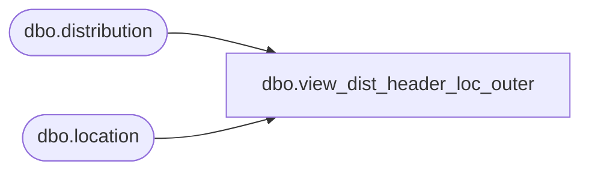

# dbo.view_dist_header_loc_outer

**Database:** me_01  
**Server:** bedrockdb02  

## Architecture Diagram



## Table Dependencies

| Referenced Table |
|---|
| dbo.distribution |
| dbo.location |

## View Code

```sql
create view dbo.view_dist_header_loc_outer AS
select distinct d.distribution_id, l.location_id, l.location_code ,l.location_short_name,
 l.location_name
 FROM location l RIGHT JOIN distribution d
on  d.location_id =l.location_id
```

