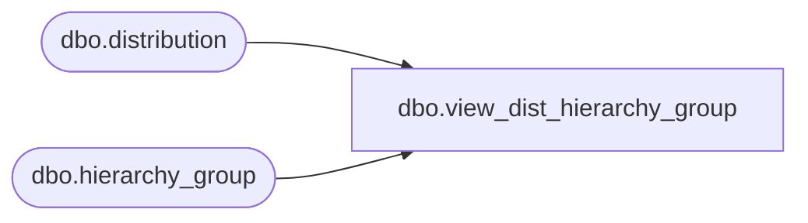

# dbo.view_dist_hierarchy_group

**Database:** me_01  
**Server:** bedrockdb02  

## Architecture Diagram



## Table Dependencies

| Referenced Table |
|---|
| dbo.distribution |
| dbo.hierarchy_group |

## View Code

```sql
create view dbo.view_dist_hierarchy_group AS
select d.distribution_id,d.volume_hierarchy_group_id,d.sell_thru_hierarchy_group_id,
 h.hierarchy_group_id , h.hierarchy_group_code volume_hierarchy_group_code,
h.hierarchy_group_label volume_hierarchy_group_label,
h.hierarchy_group_short_label volume_hierarchy_short_label,
 hs.hierarchy_group_code sell_thru_hierarchy_grp_code,
hs.hierarchy_group_label sell_thru_hierarchy_grp_lbl,
hs.hierarchy_group_short_label sell_thru_hierarchy_shrt_lbl
 FROM distribution d LEFT JOIN hierarchy_group h
on   d.volume_hierarchy_group_id = h.hierarchy_group_id 
LEFT JOIN hierarchy_group hs
on d.sell_thru_hierarchy_group_id = hs.hierarchy_group_id
```

