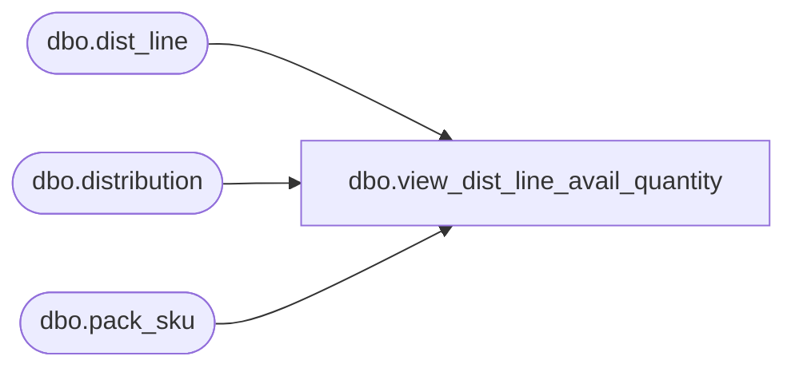

# dbo.view_dist_line_avail_quantity

**Database:** me_01  
**Server:** bedrockdb02  

## Architecture Diagram



## Table Dependencies

| Referenced Table |
|---|
| dbo.dist_line |
| dbo.distribution |
| dbo.pack_sku |

## View Code

```sql
CREATE VIEW dbo.view_dist_line_avail_quantity AS

SELECT 
 d.distribution_id, 
 SUM(dl.available_quantity)total_available_quantity,
 SUM(dl.total_distributed_detail_qty)total_distributed_quantity,
 (SUM(dl.available_quantity) - SUM(dl.total_distributed_detail_qty)) total_reserved_quantity
FROM dist_line dl, 
distribution d
WHERE d.distribution_id = dl.distribution_id and dl.pack_id is null
GROUP BY d.distribution_id
UNION 
SELECT 
 d.distribution_id, 
 SUM(dl.available_quantity)total_available_quantity,
 SUM(dl.total_distributed_detail_qty/psk.sku_quantity)total_distributed_quantity,
 (SUM(dl.available_quantity) - SUM(dl.total_distributed_detail_qty / psk.sku_quantity)) total_reserved_quantity
FROM distribution d 
LEFT OUTER JOIN dist_line dl
	ON d.distribution_id = dl.distribution_id
LEFT OUTER JOIN (SELECT	pack_id, 
			SUM(sku_quantity) AS sku_quantity 
		FROM pack_sku 
		GROUP BY pack_id
		) psk
	ON (dl.pack_id = psk.pack_id)
WHERE dl.pack_id IS NOT NULL
GROUP BY d.distribution_id
```

