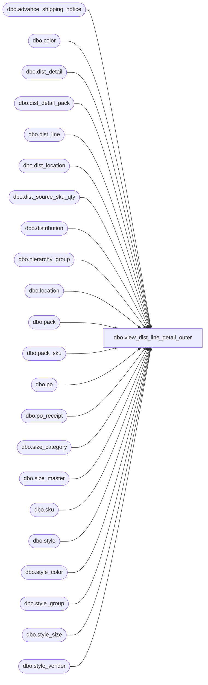

# dbo.view_dist_line_detail_outer

**Database:** me_01  
**Server:** bedrockdb02  

## Architecture Diagram



## Table Dependencies

| Referenced Table |
|---|
| dbo.advance_shipping_notice |
| dbo.color |
| dbo.dist_detail |
| dbo.dist_detail_pack |
| dbo.dist_line |
| dbo.dist_location |
| dbo.dist_source_sku_qty |
| dbo.distribution |
| dbo.hierarchy_group |
| dbo.location |
| dbo.pack |
| dbo.pack_sku |
| dbo.po |
| dbo.po_receipt |
| dbo.size_category |
| dbo.size_master |
| dbo.sku |
| dbo.style |
| dbo.style_color |
| dbo.style_group |
| dbo.style_size |
| dbo.style_vendor |

## View Code

```sql
CREATE view dbo.view_dist_line_detail_outer 
AS

-- get style/color details if distro has only style_color lines
SELECT DISTINCT
  dl.distribution_id, hd.distribution_number,
  dl.dist_line_id,
  COALESCE(dl.po_receipt_id, null) po_receipt_id,
  COALESCE(por.document_no, N'') po_receipt_no,
  COALESCE(por.document_description, N'') po_receipt_description,
  COALESCE(por.receive_date, null) receive_date,
  dl.line_state,
  dl.style_color_id,
  null pack_id,
  1 is_style_color_line,
  0 as pack_suggested_qty,
  0 as pack_distributed_qty,
  0 as pack_available_qty,
  0 as pack_reserve_qty,
  0 as pack_secondary_qty,
  a.suggested_quantity,
  a.quantity distributed_quantity,
  a.available_quantity,
  a.reserve_quantity,
  a.secondary_quantity,
  s.style_id,
  c.color_id,
  a.sku_id,
  a.location_id,
  a.eligibility_flag,
  NULL pack_code,
  NULL pack_description,
  NULL pack_short_description,
  NULL vendor_pack_code,
  a.hierarchy_group_id,
  a.style_code,
  a.long_desc,
  a.short_desc,
  a.color_code,
  a.color_long_description,
  a.color_short_description,
  a.size_category_id,
  a.size_category_code,
  a.size_code,
  a.prim_size_label,
  a.sec_size_label,
  a.prim_seq_no,
  a.sec_seq_no,
  a.style_description,
  a.style_short_description,
  a.position_id,
  a.vendor_style
  FROM dist_line dl
INNER JOIN distribution hd ON dl.distribution_id = hd.distribution_id
LEFT OUTER JOIN ( SELECT 
                     dd.distribution_id, 
                     dd.sku_id,
                     sk.style_color_id,
                     NULL pack_id,
                     dd.location_id,
                     l.location_code,
                     dd.eligibility_flag, 
                     dd.suggested_quantity,
                     dd.quantity,
                     dq.available_quantity,
                     dq.reserve_quantity,
                     dq.secondary_quantity,
                     h.hierarchy_group_id,
                     s.style_code, 
                     sc.long_desc,
                     sc.short_desc,
                     c.color_code,
                     c.color_long_description ,
                     c.color_short_description ,
                     COALESCE(s.size_category_id, 0) AS size_category_id,
                     COALESCE(scg.size_category_code, N'000') AS size_category_code,
                     sm.size_code,
                     sm.prim_size_label,
                     COALESCE(sm.sec_size_label, N' ') sec_size_label,
	       			 sm.prim_seq_no,
                     COALESCE(sm.sec_seq_no,-1) sec_seq_no,
                     s.long_desc style_description,
                     s.short_desc style_short_description,
                     s.position_id,
                     sv.vendor_style
                   FROM dist_detail dd 
				   INNER JOIN dist_line dl1 on dd.distribution_id = dl1.distribution_id
                   LEFT OUTER JOIN dist_source_sku_qty dq
                   ON dd.distribution_id = dq.distribution_id AND dd.sku_id = dq.sku_id AND dl1.dist_line_id = dq.line_id
				   inner join sku sk 
                   ON dd.sku_id = sk.sku_id 
                   inner join style s 
                   ON sk.style_id = s.style_id
                   inner join style_color sc 
                   ON sk.style_color_id =sc.style_color_id AND dl1.style_color_id = sc.style_color_id and sc.style_id = sk.style_id
                   inner join color c 
                   ON sc.color_id = c.color_id
                   inner join style_size ss 
                   ON sk.style_size_id = ss.style_size_id and ss.style_id = s.style_id
                   left outer join size_master sm 
                   ON ss.size_master_id = sm.size_master_id
				   LEFT OUTER JOIN size_category scg 
					ON scg.size_category_id = sm.size_category_id AND s.size_category_id = scg.size_category_id
                   inner join style_group sg 
                   ON s.style_id = sg.style_id AND sg.main_group_flag =1
                   inner join hierarchy_group h  
                   ON sg.hierarchy_group_id = h.hierarchy_group_id
                   LEFT outer JOIN location l
                   ON  dd.location_id = l.location_id 
                   LEFT OUTER JOIN 
			( (SELECT d.distribution_id, vs.style_id,vs.vendor_style, d.vendor_id FROM distribution d, style_vendor vs
			WHERE d.vendor_id = vs.vendor_id )
			UNION ALL
			(SELECT d.distribution_id,vs.style_id ,vs.vendor_style, po.vendor_id FROM distribution d, po po, style_vendor vs
			WHERE d.po_id = po.po_id 
			AND po.vendor_id = vs.vendor_id )
			UNION ALL
			(SELECT d.distribution_id,vs.style_id , vs.vendor_style, po.vendor_id FROM distribution d, po_receipt p, po po, style_vendor vs
			WHERE d.po_receipt_id = p.po_receipt_id
			AND p.po_id = po.po_id
			AND po.vendor_id = vs.style_vendor_id )
			UNION ALL
		     (SELECT d.distribution_id, vs.style_id ,vs.vendor_style, a.vendor_id FROM distribution d, advance_shipping_notice a, style_vendor vs
		      WHERE d.advance_shipping_notice_id = a.advance_shipping_notice_id AND a.vendor_id = vs.style_vendor_id)
			UNION ALL
		     (SELECT dl2.distribution_id, vs.style_id ,vs.vendor_style,vs.vendor_id FROM distribution d, dist_line dl2, style_color sc2, style_vendor vs
		      WHERE d.distribution_id = dl2.distribution_id 
			AND d.po_id is null 
			AND d.po_shipment_id is null 
			AND d.po_receipt_id is null 
			AND d.advance_shipping_notice_id is null
			AND d.asn_po_location_id is null
			AND dl2.style_color_id = sc2.style_color_id 
			AND sc2.style_id = vs.style_id AND vs.primary_vendor_flag = 1) ) sv
      ON s.style_id = sv.style_id AND sv.distribution_id = dd.distribution_id
      WHERE dd.pack_id IS NULL
              ) a 
ON dl.distribution_id = a.distribution_id 
AND  dl.style_color_id = a.style_color_id
LEFT OUTER JOIN sku sk
ON sk.sku_id = a.sku_id
INNER JOIN style_color sc
ON dl.style_color_id = sc.style_color_id
INNER JOIN  style s
ON sc.style_id = s.style_id
INNER JOIN color c
ON sc.color_id = c.color_id
left outer join po_receipt por on dl.po_receipt_id = por.po_receipt_id
where 0 = (select count(*) from dist_line dl2
           where dl.distribution_id = dl2.distribution_id
           and dl2.pack_id is not null)
UNION ALL
--join dist_detail_pack, get pack line details for distro has pack lines
SELECT DISTINCT 
dd.distribution_id, hd.distribution_number, 
dl.dist_line_id,
COALESCE(dl.po_receipt_id, null) po_receipt_id,
COALESCE(por.document_no, N'') po_receipt_no,
COALESCE(por.document_description, N'') po_receipt_description,
COALESCE(por.receive_date, null) receive_date,
dl.line_state,
NULL style_color_id,
p.pack_id,
0 is_style_color_line,
dd.suggested_quantity as pack_suggested_qty,
dd.quantity as pack_distributed_qty,
dq.available_quantity/pk.sku_quantity  as pack_available_qty,
dq.reserve_quantity/pk.sku_quantity as pack_reserve_qty,
dq.secondary_quantity/pk.sku_quantity as pack_secondary_qty,
COALESCE((dd.suggested_quantity * pk.sku_quantity), 0) AS suggested_quantity,
COALESCE((dd.quantity * pk.sku_quantity), 0) AS distributed_quantity,
dq.available_quantity,
dq.reserve_quantity,
dq.secondary_quantity,
s.style_id,
c.color_id,
pk.sku_id,
dll.location_id,
dd.eligibility_flag, 
p.pack_code, 
p.pack_description,
p.pack_short_description,
p.vendor_pack_code,
h.hierarchy_group_id,
s.style_code, 
sc.long_desc,
sc.short_desc,
c.color_code,
c.color_long_description ,
c.color_short_description ,            
COALESCE(s.size_category_id, 0) AS size_category_id,
COALESCE(scg.size_category_code, N'000') AS size_category_code,
sm.size_code,
sm.prim_size_label,
COALESCE(sm.sec_size_label, N' ') sec_size_label,
sm.prim_seq_no,
COALESCE(sm.sec_seq_no,-1) sec_seq_no,
s.long_desc style_description,
s.short_desc style_short_description,
s.position_id,
sv.vendor_style
FROM  dist_detail_pack dd
LEFT OUTER JOIN dist_line dl ON dl.distribution_id = dd.distribution_id AND dl.pack_id = dd.pack_id AND dl.style_color_id IS NULL 
LEFT outer join po_receipt por on dl.po_receipt_id = por.po_receipt_id
INNER JOIN distribution hd ON dl.distribution_id = hd.distribution_id
INNER JOIN dist_location dll ON dll.distribution_id = dl.distribution_id
INNER JOIN location l ON dll.location_id = l.location_id AND dd.location_id = l.location_id
LEFT OUTER JOIN dist_source_sku_qty dq ON dq.distribution_id = dd.distribution_id AND dq.line_id = dl.dist_line_id AND dq.distribution_id = dll.distribution_id
INNER JOIN pack p ON dd.pack_id = p.pack_id AND dl.pack_id = p.pack_id
INNER JOIN pack_sku pk on dd.pack_id = pk.pack_id and p.pack_id = pk.pack_id 
INNER JOIN sku sk on pk.sku_id = sk.sku_id 
INNER JOIN style s ON sk.style_id = s.style_id
LEFT OUTER JOIN size_category scg ON scg.size_category_id = s.size_category_id
INNER JOIN style_color sc ON sk.style_color_id = sc.style_color_id AND s.style_id = sc.style_id
INNER JOIN color c ON sc.color_id = c.color_id
INNER JOIN style_size ss ON sk.style_size_id = ss.style_size_id AND sk.style_id = ss.style_id
left outer JOIN size_master sm ON ss.size_master_id = sm.size_master_id AND sm.size_category_id = scg.size_category_id
INNER JOIN style_group sg ON  s.style_id = sg.style_id AND sg.main_group_flag =1
INNER JOIN hierarchy_group h ON sg.hierarchy_group_id = h.hierarchy_group_id
LEFT OUTER JOIN 
		( (	SELECT d.distribution_id, vs.style_id, vs.vendor_style, d.vendor_id 
			FROM distribution d, style_vendor vs
			WHERE d.vendor_id = vs.vendor_id )
			UNION ALL
			(SELECT d.distribution_id, vs.style_id, vs.vendor_style, po.vendor_id 
			FROM distribution d, po po, style_vendor vs
			WHERE d.po_id = po.po_id AND po.vendor_id = vs.vendor_id )
			UNION ALL
			(SELECT d.distribution_id,vs.style_id, vs.vendor_style, po.vendor_id 
			FROM distribution d, po_receipt p, po po, style_vendor vs
			WHERE d.po_receipt_id = p.po_receipt_id
			AND p.po_id = po.po_id
			AND po.vendor_id = vs.style_vendor_id )
			UNION ALL
			(SELECT d.distribution_id, vs.style_id, vs.vendor_style, a.vendor_id 
			FROM distribution d, advance_shipping_notice a , style_vendor vs
			WHERE d.advance_shipping_notice_id = a.advance_shipping_notice_id
			AND a.vendor_id = vs.style_vendor_id)
			UNION ALL
		    (SELECT dl2.distribution_id, vs.style_id ,vs.vendor_style,vs.vendor_id FROM distribution d, dist_line dl2, pack p2 , style_vendor vs
		    WHERE d.distribution_id = dl2.distribution_id 
			AND d.po_id is null 
			AND d.po_shipment_id is null 
			AND d.po_receipt_id is null 
			AND d.advance_shipping_notice_id is null
			AND d.asn_po_location_id is null
			AND dl2.pack_id = p2.pack_id
			AND p2.style_id = vs.style_id 
			AND p2.vendor_id = vs.vendor_id AND vs.primary_vendor_flag = 1) ) sv
ON s.style_id = sv.style_id AND sv.distribution_id = dd.distribution_id
WHERE dd.sku_id IS NULL or dd.sku_id = 0
UNION ALL
--join dist_detail_pack, get style/color line's detail if distro has mixed style/color and pack lines
SELECT DISTINCT 
dd.distribution_id, hd.distribution_number,
dl.dist_line_id,
COALESCE(dl.po_receipt_id, null) po_receipt_id,
COALESCE(por.document_no, N'') po_receipt_no,
COALESCE(por.document_description, N'') po_receipt_description,
COALESCE(por.receive_date, null) receive_date,
dl.line_state,
dl.style_color_id, 
NULL pack_id,
1 is_style_color_line,
0 as pack_suggested_qty,
0 as pack_distributed_qty,
0 as pack_available_qty,
0 as pack_reserve_qty,
0 as pack_secondary_qty,
dd.suggested_quantity,
dd.quantity AS distributed_quantity,
dq.available_quantity,
dq.reserve_quantity,
dq.secondary_quantity,
s.style_id,
c.color_id,
dd.sku_id,
dll.location_id,
dd.eligibility_flag,
NULL pack_code,
NULL pack_description,
NULL pack_short_description,
NULL vendor_pack_code,
h.hierarchy_group_id,
s.style_code,
sc.long_desc,
sc.short_desc,
c.color_code,
c.color_long_description,
c.color_short_description,
COALESCE(s.size_category_id, 0) AS size_category_id,
COALESCE(scg.size_category_code, N'000') AS size_category_code,
sm.size_code,
sm.prim_size_label,
COALESCE(sm.sec_size_label, N' ') sec_size_label,
sm.prim_seq_no,
COALESCE(sm.sec_seq_no,-1) sec_seq_no,
s.long_desc style_description,
s.short_desc style_short_description,
s.position_id,
sv.vendor_style
FROM dist_detail_pack dd 
LEFT OUTER JOIN dist_line dl ON dl.distribution_id = dd.distribution_id AND dl.pack_id IS NULL
LEFT outer join po_receipt por on dl.po_receipt_id = por.po_receipt_id
INNER JOIN dist_location dll ON dll.distribution_id = dl.distribution_id and dll.location_id = dd.location_id
INNER JOIN distribution hd ON dl.distribution_id = hd.distribution_id
INNER JOIN location l ON dll.location_id = l.location_id AND dd.location_id = l.location_id
LEFT OUTER JOIN dist_source_sku_qty dq ON dd.sku_id = dq.sku_id AND dq.distribution_id = dd.distribution_id AND dq.line_id = dl.dist_line_id AND dq.distribution_id = dll.distribution_id
INNER JOIN sku sk ON dd.sku_id = sk.sku_id 
INNER JOIN style s ON sk.style_id = s.style_id
INNER JOIN style_color sc ON sk.style_color_id = sc.style_color_id AND s.style_id = sc.style_id and dl.style_color_id = sc.style_color_id
INNER JOIN color c ON sc.color_id = c.color_id
INNER JOIN style_size ss ON sk.style_size_id = ss.style_size_id AND sk.style_id = ss.style_id
INNER JOIN style_group sg ON s.style_id = sg.style_id AND sg.main_group_flag = 1
INNER JOIN hierarchy_group h ON sg.hierarchy_group_id = h.hierarchy_group_id
LEFT OUTER JOIN size_category scg ON s.size_category_id = scg.size_category_id
inner JOIN size_master sm ON ss.size_master_id = sm.size_master_id 
LEFT OUTER JOIN 
		( (	SELECT d.distribution_id, vs.style_id, vs.vendor_style, d.vendor_id 
			FROM distribution d, style_vendor vs
			WHERE d.vendor_id = vs.vendor_id )
			UNION ALL
			(SELECT d.distribution_id,vs.style_id, vs.vendor_style, po.vendor_id 
			FROM distribution d, po po, style_vendor vs
			WHERE d.po_id = po.po_id AND po.vendor_id = vs.vendor_id )
			UNION ALL
			(SELECT d.distribution_id, vs.style_id, vs.vendor_style, po.vendor_id 
			FROM distribution d, po_receipt p, po po, style_vendor vs
			WHERE d.po_receipt_id = p.po_receipt_id AND p.po_id = po.po_id AND po.vendor_id = vs.style_vendor_id )
			UNION ALL
			(SELECT d.distribution_id, vs.style_id, vs.vendor_style, a.vendor_id 
			FROM distribution d, advance_shipping_notice a, style_vendor vs
			WHERE d.advance_shipping_notice_id = a.advance_shipping_notice_id AND a.vendor_id = vs.style_vendor_id)
			UNION ALL
		    SELECT dl2.distribution_id, vs.style_id ,vs.vendor_style,vs.vendor_id FROM distribution d, dist_line dl2, style_color sc2, style_vendor vs
		    WHERE d.distribution_id = dl2.distribution_id 
			AND d.po_id is null 
			AND d.po_shipment_id is null 
			AND d.po_receipt_id is null 
			AND d.advance_shipping_notice_id is null
			AND d.asn_po_location_id is null
			AND (dl2.style_color_id = sc2.style_color_id
			AND sc2.style_id = vs.style_id AND vs.primary_vendor_flag = 1) 
			UNION ALL
		    (SELECT dl2.distribution_id, vs.style_id ,vs.vendor_style,vs.vendor_id FROM distribution d, dist_line dl2, pack p2 , style_vendor vs
		    WHERE d.distribution_id = dl2.distribution_id 
			AND d.po_id is null 
			AND d.po_shipment_id is null 
			AND d.po_receipt_id is null 
			AND d.advance_shipping_notice_id is null
			AND d.asn_po_location_id is null
			AND dl2.pack_id = p2.pack_id
			AND p2.style_id = vs.style_id 
			AND p2.vendor_id = vs.vendor_id AND vs.primary_vendor_flag = 1) ) sv
ON s.style_id = sv.style_id AND sv.distribution_id = dd.distribution_id and sk.style_id = sv.style_id and sv.style_id = sc.style_id
WHERE (dd.pack_id IS NULL or dd.pack_id = 0)
```

