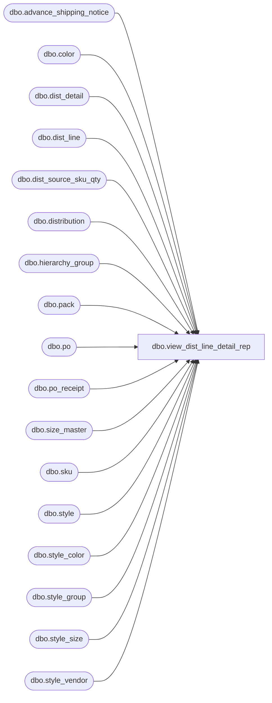

# dbo.view_dist_line_detail_rep

**Database:** me_01  
**Server:** bedrockdb02  

## Architecture Diagram



## Table Dependencies

| Referenced Table |
|---|
| dbo.advance_shipping_notice |
| dbo.color |
| dbo.dist_detail |
| dbo.dist_line |
| dbo.dist_source_sku_qty |
| dbo.distribution |
| dbo.hierarchy_group |
| dbo.pack |
| dbo.po |
| dbo.po_receipt |
| dbo.size_master |
| dbo.sku |
| dbo.style |
| dbo.style_color |
| dbo.style_group |
| dbo.style_size |
| dbo.style_vendor |

## View Code

```sql
CREATE view [dbo].[view_dist_line_detail_rep] 
as

/*
View name: view_dist_line_detail_rep

Description: 


HISTORY:
Date       			Name         		Def#			Desc
NO HISTORY WAS KEPT PRIOR TO THIS DATE...
Nov 24, 2009		Sameer Patel		114380			problem with print for picking since migrating from sql 2000 to sql 2005.
														Added distribution_number to view so it can be use in table links in AR metadata
Mar 14, 2010		Sameer Patel		116532			reporting services query error (Poor perfSromance due to subquery returning vendor_style)
*/

SELECT DISTINCT
	dl.distribution_id, hd.distribution_number
	, dl.dist_line_id
		, dl.style_color_id, dl.pack_id
	, dq.available_quantity
		, dq.reserve_quantity
			, dq.secondary_quantity
	, dl.line_state
	, s.style_id, c.color_id
	, dd.dist_detail_id
		, dd.sku_id
			, dd.location_id
		, dd.suggested_quantity
			, dd.quantity
	, NULL pack_code, NULL pack_description, NULL pack_short_description, NULL vendor_pack_code
	, hg.hierarchy_group_id
	, s.style_code, sc.long_desc, s.short_desc
	, c.color_code, c.color_long_description, c.color_short_description
	, sm.size_code, sm.prim_size_label, sm.sec_size_label
		, sm.prim_seq_no, sm.sec_seq_no
	, s.long_desc style_description, s.short_desc style_short_description
		, s.position_id
	, CASE 
		WHEN hd.document_source IN (7,8) THEN sv1.vendor_style
		WHEN hd.document_source IN (1,2,3) THEN sv2.vendor_style 
		WHEN hd.document_source IN (5) THEN COALESCE(sv3.vendor_style, sv2.vendor_style)
		WHEN hd.document_source IN (4) THEN COALESCE(sv4.vendor_style, sv2.vendor_style) 
		ELSE sv5.vendor_style END vendor_style
FROM
	dist_line dl
INNER JOIN distribution hd ON dl.distribution_id = hd.distribution_id
INNER JOIN ( style_color sc
				INNER JOIN style s ON sc.style_id = s.style_id
				INNER JOIN color c ON sc.color_id = c.color_id
				INNER JOIN style_group sg ON s.style_id = sg.style_id AND sg.main_group_flag = 1
				INNER JOIN hierarchy_group hg ON sg.hierarchy_group_id = hg.hierarchy_group_id ) ON dl.style_color_id = sc.style_color_id
																									AND (dl.pack_id IS NULL or dl.pack_id = 0)				
INNER JOIN ( dist_detail dd
				INNER JOIN sku k ON dd.sku_id = k.sku_id
				INNER JOIN style_size sz ON k.style_size_id = sz.style_size_id
				INNER JOIN size_master sm ON sz.size_master_id = sm.size_master_id ) ON dl.distribution_id = dd.distribution_id
																							AND dl.style_color_id = k.style_color_id
																							AND (dl.pack_id IS NULL or dl.pack_id = 0)				
LEFT OUTER JOIN dist_source_sku_qty dq ON dl.distribution_id = dq.distribution_id
												AND dq.sku_id = dd.sku_id
												AND (dl.pack_id IS NULL or dl.pack_id = 0)
LEFT OUTER JOIN style_vendor sv1 ON hd.vendor_id = sv1.vendor_id AND hd.document_source IN (7,8) AND sc.style_id = sv1.style_id
LEFT OUTER JOIN ( style_vendor sv2 
					INNER JOIN po p2 ON sv2.vendor_id = p2.vendor_id ) ON hd.po_id = p2.po_id AND hd.document_source IN (1,2,3,4,5) AND sc.style_id = sv2.style_id
LEFT OUTER JOIN ( style_vendor sv3 
					INNER JOIN po p3 ON sv3.vendor_id = p3.vendor_id
					INNER JOIN po_receipt pr3 ON p3.po_id = pr3.po_id ) ON hd.po_receipt_id = pr3.po_receipt_id AND hd.document_source IN (5) AND sc.style_id = sv3.style_id
LEFT OUTER JOIN ( style_vendor sv4
					INNER JOIN advance_shipping_notice a4 ON sv4.vendor_id = a4.vendor_id ) ON hd.advance_shipping_notice_id = a4.advance_shipping_notice_id AND hd.document_source IN (4) AND sc.style_id = sv4.style_id
LEFT OUTER JOIN style_vendor sv5 ON sc.style_id = sv5.style_id AND sv5.primary_vendor_flag = 1 
										AND NOT hd.document_source IN (1,2,3,4,5,7,8)
UNION ALL
SELECT
	dl.distribution_id, hd.distribution_number
	, dl.dist_line_id
		, dl.style_color_id, dl.pack_id
	, dq.available_quantity
		, dq.reserve_quantity
			, dq.secondary_quantity
	, dl.line_state
	, s.style_id, c.color_id
	, dd.dist_detail_id
		, dd.sku_id
			, dd.location_id
		, dd.suggested_quantity
			, dd.quantity
	, p.pack_code, p.pack_description, p.pack_short_description, p.vendor_pack_code
	, hg.hierarchy_group_id
	, s.style_code, sc.long_desc, s.short_desc
	, c.color_code, c.color_long_description, c.color_short_description
	, sm.size_code, sm.prim_size_label, sm.sec_size_label
		, sm.prim_seq_no, sm.sec_seq_no
	, s.long_desc style_description, s.short_desc style_short_description
		, s.position_id
	, CASE 
		WHEN hd.document_source IN (7,8) THEN sv1.vendor_style
		WHEN hd.document_source IN (1,2,3) THEN sv2.vendor_style 
		WHEN hd.document_source IN (5) THEN COALESCE(sv3.vendor_style, sv2.vendor_style)
		WHEN hd.document_source IN (4) THEN COALESCE(sv4.vendor_style, sv2.vendor_style) 
		ELSE sv5.vendor_style END vendor_style
FROM
	dist_line dl
INNER JOIN distribution hd ON dl.distribution_id = hd.distribution_id
INNER JOIN pack p ON dl.pack_id = p.pack_id AND NOT (dl.pack_id IS NULL or dl.pack_id = 0)
INNER JOIN ( dist_detail dd
				INNER JOIN sku k ON dd.sku_id = k.sku_id
				INNER JOIN style_color sc ON k.style_color_id = sc.style_color_id AND k.style_id = sc.style_id
				INNER JOIN style s ON sc.style_id = s.style_id
				INNER JOIN color c ON sc.color_id = c.color_id
				INNER JOIN style_group sg ON s.style_id = sg.style_id AND sg.main_group_flag = 1
				INNER JOIN hierarchy_group hg ON sg.hierarchy_group_id = hg.hierarchy_group_id
				INNER JOIN style_size sz ON k.style_size_id = sz.style_size_id
				INNER JOIN size_master sm ON sz.size_master_id = sm.size_master_id ) ON dl.distribution_id = dd.distribution_id
																							AND dl.pack_id = dd.pack_id
																							AND NOT (dl.pack_id IS NULL or dl.pack_id = 0)
LEFT OUTER JOIN dist_source_sku_qty dq ON dl.distribution_id = dq.distribution_id
												AND dq.sku_id = dd.sku_id
												AND NOT (dl.pack_id IS NULL or dl.pack_id = 0)
LEFT OUTER JOIN style_vendor sv1 ON hd.vendor_id = sv1.vendor_id AND hd.document_source IN (7,8) AND p.style_id = sv1.style_id
LEFT OUTER JOIN ( style_vendor sv2 
					INNER JOIN po p2 ON sv2.vendor_id = p2.vendor_id ) ON hd.po_id = p2.po_id AND hd.document_source IN (1,2,3,4,5) AND p.style_id = sv2.style_id
LEFT OUTER JOIN ( style_vendor sv3 
					INNER JOIN po p3 ON sv3.vendor_id = p3.vendor_id
					INNER JOIN po_receipt pr3 ON p3.po_id = pr3.po_id ) ON hd.po_receipt_id = pr3.po_receipt_id AND hd.document_source IN (5) AND p.style_id = sv3.style_id
LEFT OUTER JOIN ( style_vendor sv4
					INNER JOIN advance_shipping_notice a4 ON sv4.vendor_id = a4.vendor_id ) ON hd.advance_shipping_notice_id = a4.advance_shipping_notice_id AND hd.document_source IN (4) AND p.style_id = sv4.style_id
LEFT OUTER JOIN style_vendor sv5 ON p.style_id = sv5.style_id AND sv5.primary_vendor_flag = 1 
										AND NOT hd.document_source IN (1,2,3,4,5,7,8)
```

