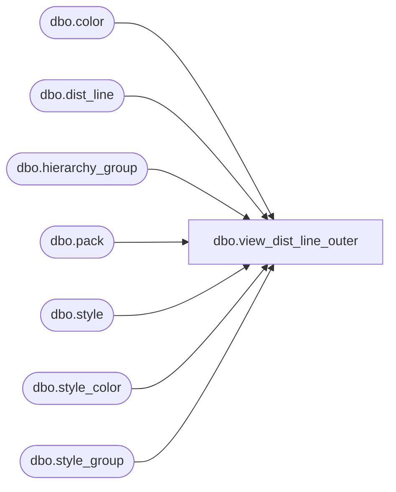

# dbo.view_dist_line_outer

**Database:** me_01  
**Server:** bedrockdb02  

## Architecture Diagram



## Table Dependencies

| Referenced Table |
|---|
| dbo.color |
| dbo.dist_line |
| dbo.hierarchy_group |
| dbo.pack |
| dbo.style |
| dbo.style_color |
| dbo.style_group |

## View Code

```sql
create view dbo.view_dist_line_outer AS
SELECT     dl.distribution_id, dl.dist_line_id, dl.style_color_id pack_id_or_style_color_id, NULL pack_code, NULL pack_description, NULL pack_short_description, 
                      h.hierarchy_group_id, h.hierarchy_group_code, h.hierarchy_group_short_label, h.hierarchy_group_label, s.style_id, s.style_code, c.color_code, 
                      c.color_long_description, c.color_short_description, s.long_desc style_description, s.short_desc style_short_description, dl.available_quantity, 
                      dl.total_distributed_detail_qty
FROM         dist_line dl, style_color sc, style s, color c, style_group sg, hierarchy_group h
WHERE     dl.style_color_id IS NOT NULL AND dl.style_color_id = sc.style_color_id AND sc.color_id = c.color_id AND sc.style_id = s.style_id AND 
                      s.style_id = sg.style_id AND sg.main_group_flag = 1 AND sg.hierarchy_group_id = h.hierarchy_group_id
UNION ALL
SELECT     dl.distribution_id, dl.dist_line_id, dl.pack_id pack_id_or_style_color_id, p.pack_code, p.pack_description, p.pack_short_description, 
                      h.hierarchy_group_id, h.hierarchy_group_code, h.hierarchy_group_short_label, h.hierarchy_group_label, s.style_id, s.style_code, NULL 
                      color_code, NULL color_long_description, NULL color_short_description, s.long_desc style_description, s.short_desc style_short_description, 
                      dl.available_quantity, dl.total_distributed_detail_qty
FROM         dist_line dl, pack p, style s, style_group sg, hierarchy_group h
WHERE     dl.pack_id IS NOT NULL AND dl.pack_id = p.pack_id AND p.style_id = s.style_id AND s.style_id = sg.style_id AND sg.main_group_flag = 1 AND 
                      sg.hierarchy_group_id = h.hierarchy_group_id
```

