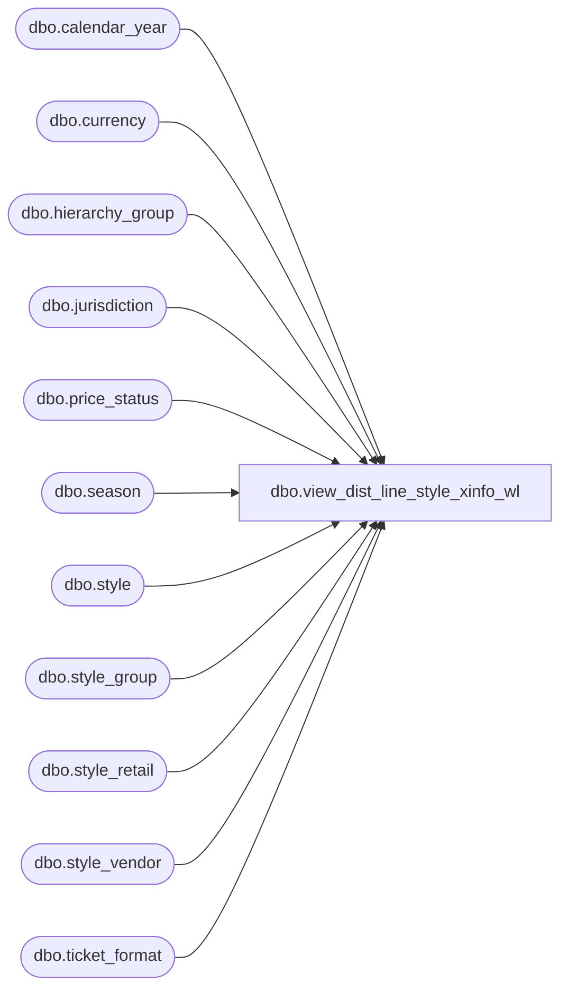

# dbo.view_dist_line_style_xinfo_wl

**Database:** me_01  
**Server:** bedrockdb02  

## Architecture Diagram



## Table Dependencies

| Referenced Table |
|---|
| dbo.calendar_year |
| dbo.currency |
| dbo.hierarchy_group |
| dbo.jurisdiction |
| dbo.price_status |
| dbo.season |
| dbo.style |
| dbo.style_group |
| dbo.style_retail |
| dbo.style_vendor |
| dbo.ticket_format |

## View Code

```sql
CREATE VIEW dbo.view_dist_line_style_xinfo_wl AS
SELECT s.style_id, s.style_code, s.long_desc style_long_description, s.short_desc style_short_description,
s.create_date, s.style_status, s.style_type, s.consignment_flag, s.depth, 
s.distribution_multiple, s.fashion_flag, s.height, s.inhouse_upc_flag,
s.order_multiple, s.promo_flag, s.replenishable_flag, s.resulting_po_predistrib_type,
s.active_flag style_active_flag, s.plu_desc style_plu_desc, s.reorder_flag,
s.target_selling_from_week, s.target_selling_from_year, s.target_selling_to_week, s.target_selling_to_year, 
s.vendor_upc_flag, s.weight, s.width,
sr.compare_at_retail, sr.current_valuation_retail, sr.original_valuation_retail,
ops.price_status_desc original_price_status_desc,
cps.price_status_desc current_price_status_desc,
stf.ticket_format_description st_ticket_format_description,
seas.season_description, 
scy.calendar_year_code,
sv.vendor_style, sv.primary_vendor_flag, sv.current_cost,
svc.currency_code, svc.currency_description,
hg.hierarchy_group_id, hg.hierarchy_group_code, hg.hierarchy_group_label, hg.hierarchy_group_short_label,
hg.alternate_hierarchy_group_code, hg.goal_imu_percent, hg.imu_tolerance_percent, hg.active_flag hg_active_flag,
hg.plu_description hg_plu_description, hg.pos_merch_group_key, hg.sl_minimum_cost_percent, hg.sl_maximum_cost_percent,
hg.shrinkage_provision_percent,
hgtf.ticket_format_description hg_ticket_format_description
FROM  style_group sg, season seas, style s
LEFT OUTER JOIN style_retail sr ON s.style_id = sr.style_id
LEFT OUTER JOIN jurisdiction j ON sr.jurisdiction_id = j.jurisdiction_id AND j.home_jurisdiction_flag = 1
LEFT OUTER JOIN price_status ops ON sr.original_price_status_id = ops.price_status_id
LEFT OUTER JOIN price_status cps ON sr.original_price_status_id = cps.price_status_id
LEFT OUTER JOIN ticket_format stf ON s.ticket_format_id = stf.ticket_format_id
LEFT OUTER JOIN calendar_year scy ON s.calendar_year_id = scy.calendar_year_id 
LEFT OUTER JOIN style_vendor sv ON s.style_id = sv.style_id AND sv.primary_vendor_flag = 1
LEFT OUTER JOIN currency svc ON sv.currency_id = svc.currency_id ,
hierarchy_group hg
LEFT OUTER JOIN ticket_format hgtf ON hg.ticket_format_id = hgtf.ticket_format_id
WHERE s.style_id = sg.style_id
AND sg.main_group_flag =1
AND sg.hierarchy_group_id = hg.hierarchy_group_id
AND s.season_id = seas.season_id
```

