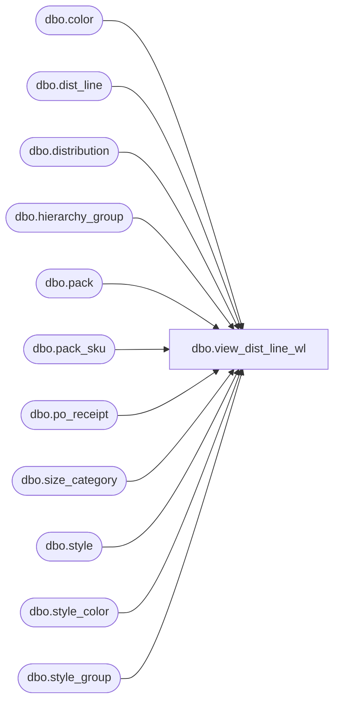

# dbo.view_dist_line_wl

**Database:** me_01  
**Server:** bedrockdb02  

## Architecture Diagram



## Table Dependencies

| Referenced Table |
|---|
| dbo.color |
| dbo.dist_line |
| dbo.distribution |
| dbo.hierarchy_group |
| dbo.pack |
| dbo.pack_sku |
| dbo.po_receipt |
| dbo.size_category |
| dbo.style |
| dbo.style_color |
| dbo.style_group |

## View Code

```sql
CREATE VIEW dbo.view_dist_line_wl AS

SELECT dl.distribution_id, d.distribution_number, dl.dist_line_id, d.po_id, dl.po_line_id, dl.pack_id, dl.style_color_id, dl.available_quantity, null line_available_pack_quantity, dl.total_distributed_detail_qty, null line_distributed_pack_quantity, dl.total_suggested_detail_qty, null line_suggested_pack_quantity, (dl.available_quantity - dl.total_distributed_detail_qty) AS line_reserve_quantity, null line_reserve_pack_quantity,  
s.style_id, s.style_code, s.long_desc style_long_description, s.short_desc style_short_description,
sc.long_desc styleclr_long_description, sc.short_desc styleclr_short_description, sc.fashion_flag styleclr_fashion_flag, sc.reorder_flag styleclr_reorder_flag,
hg.hierarchy_group_id, hg.hierarchy_group_code, hg.hierarchy_group_label, hg.hierarchy_group_short_label,
c.color_code, c.color_long_description ,c.color_short_description, scg.size_category_id, scg.size_category_code,
NULL pack_code, NULL pack_description, NULL pack_short_description, NULL pack_active_flag, NULL pack_status, NULL pack_type, NULL vendor_pack_code, NULL pack_vendor_upc_flag
, COALESCE(dl.po_receipt_id, null) po_receipt_id
, COALESCE(por.document_no, N'') po_receipt_no
, COALESCE(por.document_description, N'') po_receipt_description
, COALESCE(por.receive_date, null) receive_date
FROM  dist_line dl 
LEFT OUTER JOIN distribution d ON dl.distribution_id = d.distribution_id
LEFT OUTER JOIN style_color sc ON dl.style_color_id = sc.style_color_id
LEFT OUTER JOIN style s ON s.style_id = sc.style_id
LEFT OUTER JOIN size_category scg ON scg.size_category_id = s.size_category_id
LEFT OUTER JOIN color c ON c.color_id = sc.color_id
LEFT OUTER JOIN style_group sg ON sg.style_id = s.style_id AND sg.main_group_flag = 1
LEFT OUTER JOIN hierarchy_group hg ON hg.hierarchy_group_id = sg.hierarchy_group_id
LEFT OUTER JOIN po_receipt por on dl.po_receipt_id = por.po_receipt_id
WHERE dl.style_color_id IS NOT NULL
UNION ALL
SELECT dl.distribution_id, d.distribution_number, dl.dist_line_id, d.po_id, dl.po_line_id, dl.pack_id, dl.style_color_id, dl.available_quantity * pk.sku_quantity AS available_quantity, dl.available_quantity AS line_available_pack_quantity, dl.total_distributed_detail_qty *pk.sku_quantity AS total_distributed_detail_qty, dl.total_distributed_detail_qty AS line_distributed_pack_quantity, dl.total_suggested_detail_qty * pk.sku_quantity AS total_suggested_detail_qty, dl.total_suggested_detail_qty AS line_suggested_pack_quantity, (dl.available_quantity - dl.total_distributed_detail_qty) * pk.sku_quantity AS line_reserve_quantity, (dl.available_quantity - dl.total_distributed_detail_qty) AS line_reserve_pack_quantity,  
s.style_id, s.style_code, s.long_desc style_long_description, s.short_desc style_short_description,
NULL styleclr_long_description, NULL styleclr_short_description, NULL styleclr_fashion_flag, NULL styleclr_reorder_flag,
hg.hierarchy_group_id, hg.hierarchy_group_code, hg.hierarchy_group_label, hg.hierarchy_group_short_label,
NULL color_code, NULL color_long_description , NULL color_short_description, scg.size_category_id, scg.size_category_code,
p.pack_code,p.pack_description,p.pack_short_description,p.active_flag pack_active_flag,p.pack_status,p.pack_type,p.vendor_pack_code,p.vendor_upc_flag pack_vendor_upc_flag
, COALESCE(dl.po_receipt_id, null) po_receipt_id
, COALESCE(por.document_no, N'') po_receipt_no
, COALESCE(por.document_description, N'') po_receipt_description
, COALESCE(por.receive_date, null) receive_date
FROM  dist_line dl 
LEFT OUTER JOIN distribution d ON dl.distribution_id = d.distribution_id
LEFT OUTER JOIN pack p ON dl.pack_id = p.pack_id
left outer join (select pack_sku.pack_id, sum(pack_sku.sku_quantity) AS sku_quantity from pack_sku group by pack_sku.pack_id) pk  on pk.pack_id = dl.pack_id
LEFT OUTER JOIN style s ON s.style_id = p.style_id
LEFT OUTER JOIN size_category scg ON scg.size_category_id = s.size_category_id
LEFT OUTER JOIN style_group sg ON s.style_id = sg.style_id AND sg.main_group_flag =1
LEFT OUTER JOIN hierarchy_group hg ON hg.hierarchy_group_id = sg.hierarchy_group_id
LEFT OUTER JOIN po_receipt por on dl.po_receipt_id = por.po_receipt_id
WHERE dl.pack_id IS NOT NULL
```

