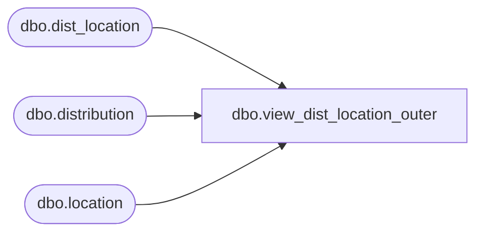

# dbo.view_dist_location_outer

**Database:** me_01  
**Server:** bedrockdb02  

## Architecture Diagram



## Table Dependencies

| Referenced Table |
|---|
| dbo.dist_location |
| dbo.distribution |
| dbo.location |

## View Code

```sql
create view dbo.view_dist_location_outer as
select distinct d.distribution_id,dl.location_id,
l.location_code, l.location_name, l.location_short_name,
 dl.dist_grp_instruction_id, dl.suggested_quantity,dl.instruction,
dl.instruction_value, dl.dist_volume_grade_id, dl.dist_sell_thru_grade_id,
 dl.number_weeks_sales,dl.effective_inventory,dl.unit_sales,dl.retail_sales,dl.on_hand, 
 dl.hist_unit_sales,dl.hist_retail_sales, dl.hist_on_hand, dl.hist_effective_inventory,
dl.expected_receipt_date,dl.prior_dist_flag,dl.prior_dist_quantity,
dl.desired_quantity,dl.ots_flag,dl.remaining_sales 
 from dist_location dl
right join distribution d 
on d.distribution_id =dl.distribution_id
left join location l
on dl.location_id = l.location_id
```

