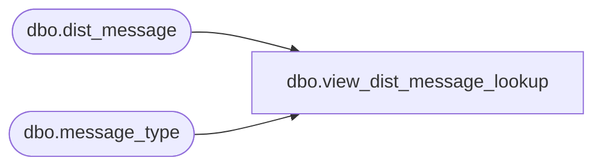

# dbo.view_dist_message_lookup

**Database:** me_01  
**Server:** bedrockdb02  

## Architecture Diagram



## Table Dependencies

| Referenced Table |
|---|
| dbo.dist_message |
| dbo.message_type |

## View Code

```sql
create view dbo.view_dist_message_lookup as
select distinct a.message_type_id,
a.message_type_description, a.transaction_type , b.message_text
from message_type a, dist_message b 
where a.transaction_type =6
and a.message_type_id = b.message_type_id
```

