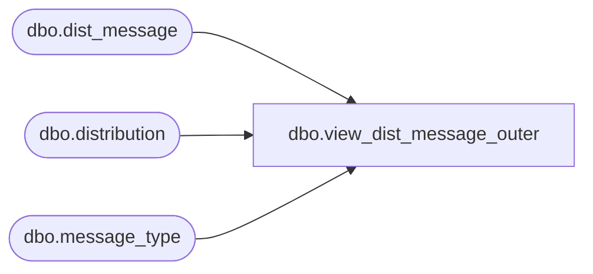

# dbo.view_dist_message_outer

**Database:** me_01  
**Server:** bedrockdb02  

## Architecture Diagram



## Table Dependencies

| Referenced Table |
|---|
| dbo.dist_message |
| dbo.distribution |
| dbo.message_type |

## View Code

```sql
create view dbo.view_dist_message_outer  AS
SELECT DISTINCT
  a.distribution_id,            
  e.message_text,   
  e.message_type_id,
  b.transaction_type,
  b.message_type_description           
FROM dist_message e 
RIGHT OUTER  JOIN distribution a 
ON a.distribution_id =e.distribution_id 
LEFT OUTER JOIN  message_type b
ON e.message_type_id = b.message_type_id 
AND b.transaction_type =6
```

