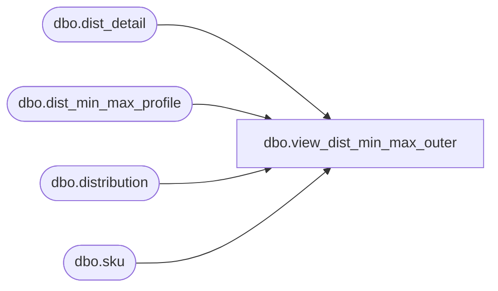

# dbo.view_dist_min_max_outer

**Database:** me_01  
**Server:** bedrockdb02  

## Architecture Diagram



## Table Dependencies

| Referenced Table |
|---|
| dbo.dist_detail |
| dbo.dist_min_max_profile |
| dbo.distribution |
| dbo.sku |

## View Code

```sql
CREATE view dbo.view_dist_min_max_outer 
as

SELECT DISTINCT
dm.distribution_id,
d.distribution_method,
dm.dist_detail_id,
dd.sku_id,
dm.minimum,
dm.maximum,
dm.presentation_stock,
dm.capacity_maximum,
dm.order_point,
dm.incl_pres_stock_with_ord_pt_fl,
dm.on_hand_units,
dm.in_transit_units,
dm.allocated_units,
dm.on_order_units,
dm.original_suggested_quantity,
dm.adjusted_quantity,
dm.short_shipped_quantity
FROM dist_min_max_profile dm
LEFT OUTER JOIN distribution d ON dm.distribution_id = d.distribution_id AND d.distribution_method = 3 --min max method
LEFT OUTER JOIN dist_detail dd ON dm.distribution_id = dd.distribution_id AND dm.dist_detail_id = dd.dist_detail_id
LEFT OUTER JOIN sku k ON k.sku_id = dd.sku_id
```

