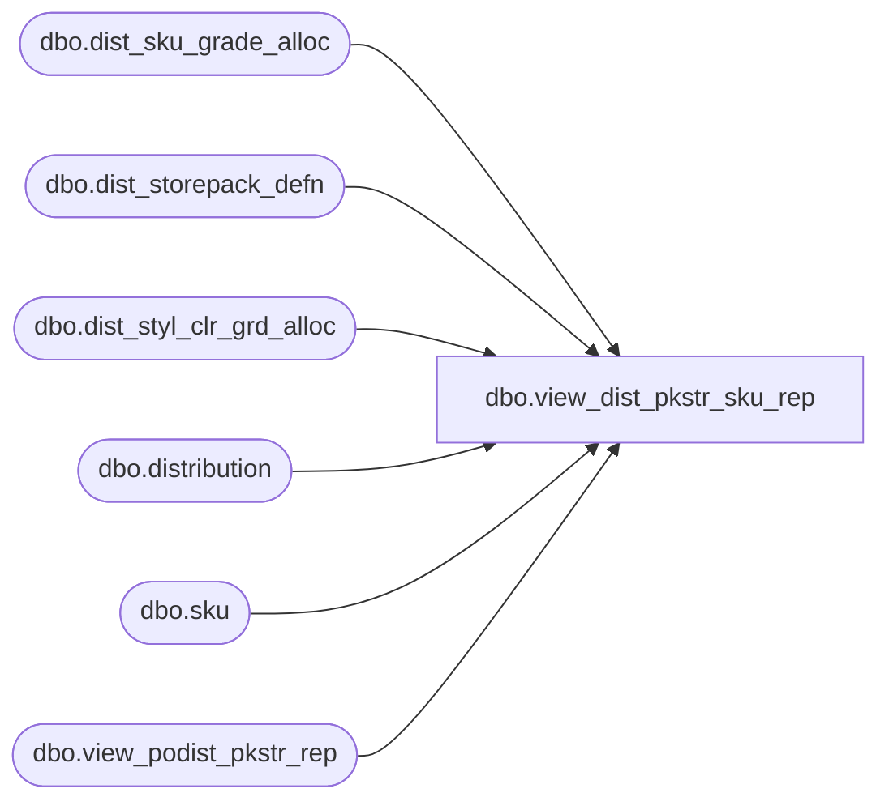

# dbo.view_dist_pkstr_sku_rep

**Database:** me_01  
**Server:** bedrockdb02  

## Architecture Diagram



## Table Dependencies

| Referenced Table |
|---|
| dbo.dist_sku_grade_alloc |
| dbo.dist_storepack_defn |
| dbo.dist_styl_clr_grd_alloc |
| dbo.distribution |
| dbo.sku |
| dbo.view_podist_pkstr_rep |

## View Code

```sql
CREATE VIEW dbo.view_dist_pkstr_sku_rep 
AS
SELECT dsga.distribution_id, d.po_id, d.po_shipment_id, dsga.sku_id, dsga.dist_style_color_grd_alloc_id, 
dscga.storepack_definition_id, dspd.volume_grade_id, vw.grade_code, dsga.distributed_quantity, vw.grade_loc_count, case vw.grade_loc_count WHEN 0 then dsga.distributed_quantity ELSE dsga.distributed_quantity/vw.grade_loc_count END AS dq_per_location,
k.style_id, k.style_color_id
FROM dist_sku_grade_alloc dsga
INNER JOIN dist_styl_clr_grd_alloc dscga ON dscga.distribution_id = dsga.distribution_id AND dscga.dist_style_color_grd_alloc_id = dsga.dist_style_color_grd_alloc_id
LEFT OUTER JOIN dist_storepack_defn dspd ON dscga.storepack_definition_id = dspd.dist_storepack_definition_id
LEFT OUTER JOIN distribution d ON d.distribution_id = dsga.distribution_id AND d.distribution_id = dspd.distribution_id
LEFT OUTER JOIN view_podist_pkstr_rep vw ON dscga.distribution_id = vw.distribution_id AND vw.distribution_id = dsga.distribution_id AND dspd.volume_grade_id = vw.dist_volume_grade_id 
INNER JOIN sku k ON k.sku_id = dsga.sku_id and k.style_color_id = dscga.style_color_id
WHERE d.document_source = 1
```

