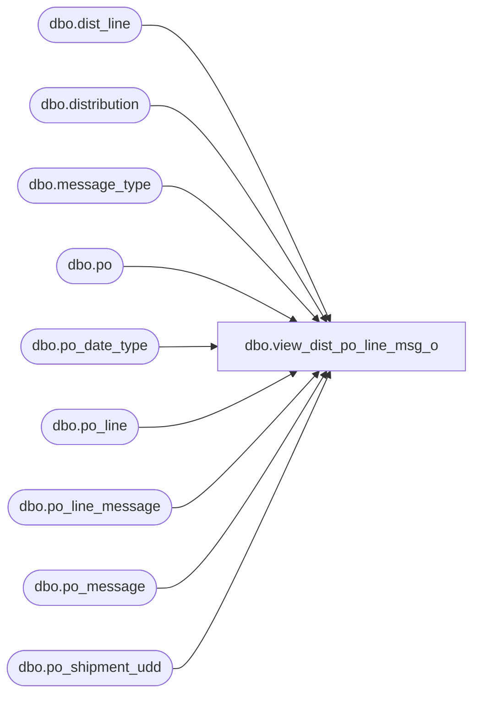

# dbo.view_dist_po_line_msg_o

**Database:** me_01  
**Server:** bedrockdb02  

## Architecture Diagram



## Table Dependencies

| Referenced Table |
|---|
| dbo.dist_line |
| dbo.distribution |
| dbo.message_type |
| dbo.po |
| dbo.po_date_type |
| dbo.po_line |
| dbo.po_line_message |
| dbo.po_message |
| dbo.po_shipment_udd |

## View Code

```sql
CREATE VIEW dbo.view_dist_po_line_msg_o AS
SELECT	DISTINCT
		d.distribution_id,
		dl.dist_line_id,
		COALESCE(po.po_id, null) AS po_id,
		COALESCE(pl.po_line_id, null) AS po_line_id,
		pm.message_type_id AS po_msg_type_id,
		pm.message AS po_message,
		mt.message_type_description AS po_msg_type_desc,
		plm.message_type_id AS po_line_msg_type_id,
		plm.message AS po_line_msg,
		m.message_type_description AS po_line_msg_type_desc,
		psu.user_defined_date AS po_shipment_udd,
		pdt.date_type_code AS date_type_code,
		pdt.description AS po_date_type_description
FROM	po po
		right join distribution d ON d.po_id = po.po_id
		Left OUTER  JOIN dist_line dl ON d.distribution_id = dl.distribution_id
		LEFT OUTER JOIN po_line pl ON po.po_id = pl.po_id and dl.po_line_id = pl.po_line_id 
		LEFT OUTER JOIN po_line_message plm ON (po.po_id = plm.po_id and pl.po_line_id = plm.po_line_id and pl.po_line_id = dl.po_line_id)
		LEFT OUTER JOIN message_type m ON (plm.message_type_id = m.message_type_id)
		LEFT OUTER JOIN po_message pm ON (po.po_id = pm.po_id)
		LEFT OUTER JOIN message_type mt ON (mt.message_type_id = pm.message_type_id)
		LEFT OUTER JOIN po_shipment_udd psu ON (psu.po_id = po.po_id )
		LEFT OUTER JOIN po_date_type pdt ON (pdt.po_date_type_id = psu.po_date_type_id)
```

