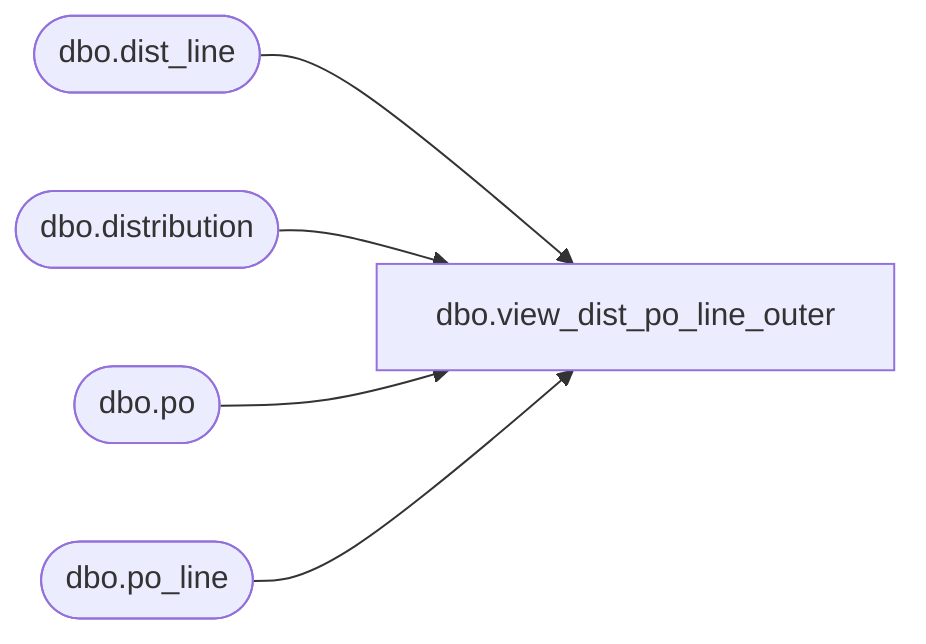

# dbo.view_dist_po_line_outer

**Database:** me_01  
**Server:** bedrockdb02  

## Architecture Diagram



## Table Dependencies

| Referenced Table |
|---|
| dbo.dist_line |
| dbo.distribution |
| dbo.po |
| dbo.po_line |

## View Code

```sql
CREATE VIEW dbo.view_dist_po_line_outer
AS
SELECT d.distribution_id, dl.dist_line_id,
po.po_id, COALESCE(po.po_no, N'') as po_no, pl.po_line_id, COALESCE(pl.line_no, null) as line_no, COALESCE(pl.repeat_order_flag, null) as repeat_order_flag, COALESCE(pl.store_pack_flag, null) as store_pack_flag
FROM distribution d LEFT OUTER JOIN po on d.po_id = po.po_id
RIGHT OUTER JOIN dist_line dl on d.distribution_id = dl.distribution_id
LEFT OUTER JOIN po_line pl on pl.po_id = d.po_id and dl.po_line_id = pl.po_line_id
```

