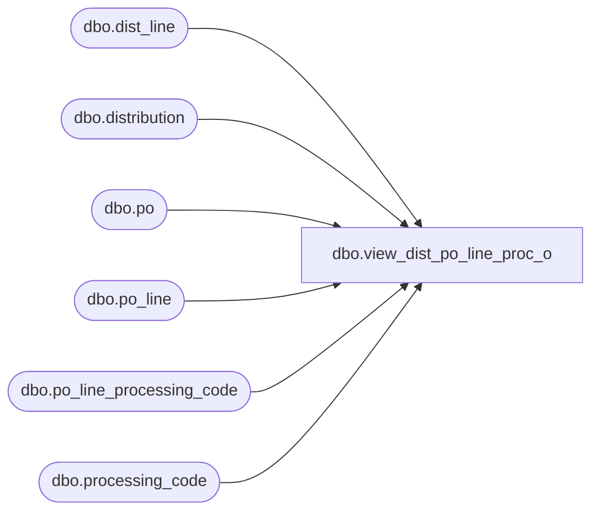

# dbo.view_dist_po_line_proc_o

**Database:** me_01  
**Server:** bedrockdb02  

## Architecture Diagram



## Table Dependencies

| Referenced Table |
|---|
| dbo.dist_line |
| dbo.distribution |
| dbo.po |
| dbo.po_line |
| dbo.po_line_processing_code |
| dbo.processing_code |

## View Code

```sql
CREATE VIEW dbo.view_dist_po_line_proc_o AS
SELECT	DISTINCT
		d.distribution_id,
		dl.dist_line_id,
		COALESCE(po.po_id, null) AS po_id,
		COALESCE(pl.po_line_id, null) AS po_line_id,
		COALESCE(proce.processing_code_id, null) AS processing_code_id,
		proce.process_type,
		COALESCE(proce.processing_code, N'') AS processing_code,
		COALESCE(proce.description, N'') AS description
FROM	distribution d
		LEFT OUTER JOIN dist_line dl ON d.distribution_id = dl.distribution_id
		LEFT OUTER JOIN po ON d.po_id = po.po_id
		LEFT OUTER JOIN po_line pl ON po.po_id = pl.po_id and dl.po_line_id = pl.po_line_id 
		LEFT OUTER JOIN po_line_processing_code plpc ON (pl.po_line_id = plpc.po_line_id AND pl.po_id = plpc.po_id)
		LEFT OUTER JOIN processing_code proce ON (plpc.processing_code_id = proce.processing_code_id)
```

