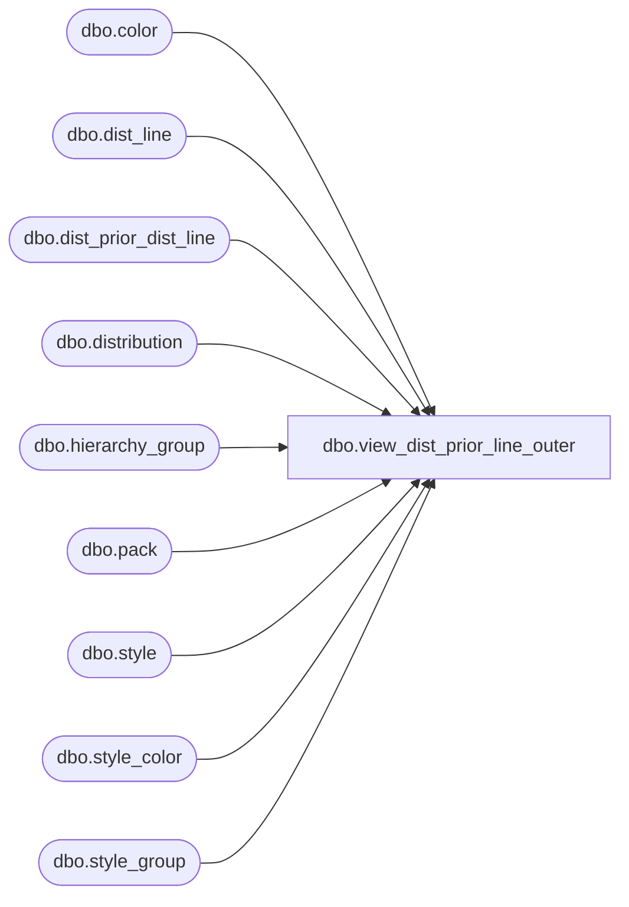

# dbo.view_dist_prior_line_outer

**Database:** me_01  
**Server:** bedrockdb02  

## Architecture Diagram



## Table Dependencies

| Referenced Table |
|---|
| dbo.color |
| dbo.dist_line |
| dbo.dist_prior_dist_line |
| dbo.distribution |
| dbo.hierarchy_group |
| dbo.pack |
| dbo.style |
| dbo.style_color |
| dbo.style_group |

## View Code

```sql
create view dbo.view_dist_prior_line_outer AS
SELECT DISTINCT 
                      d .distribution_id, dpdl.prior_distribution_id, dp.distribution_number AS prior_distribution_number, 
                      dp.distribution_description AS prior_distribution_description, dl.style_color_id, h.hierarchy_group_id, h.hierarchy_group_code, 
                      h.hierarchy_group_short_label, h.hierarchy_group_label, s.style_id, s.style_code, sc.long_desc AS style_color_long_desc, c.color_code, 
                      c.color_long_description, c.color_short_description, s.long_desc, s.short_desc, dl.pack_id, NULL AS pack_code, NULL AS pack_description
FROM         dbo.distribution d LEFT OUTER JOIN
                      dbo.dist_prior_dist_line dpdl ON d .distribution_id = dpdl.distribution_id LEFT OUTER JOIN
                      dbo.dist_line dl ON dpdl.prior_distribution_id = dl.distribution_id AND dpdl.prior_dist_line_id = dl.dist_line_id LEFT OUTER JOIN
                      dbo.distribution dp ON dpdl.prior_distribution_id = dp.distribution_id LEFT OUTER JOIN
                      dbo.style_color sc ON dl.style_color_id = sc.style_color_id LEFT OUTER JOIN
                      dbo.style s ON sc.style_id = s.style_id LEFT OUTER JOIN
                      dbo.color c ON sc.color_id = c.color_id LEFT OUTER JOIN
                      dbo.style_group sg ON s.style_id = sg.style_id AND sg.main_group_flag = 1 LEFT OUTER JOIN
                      dbo.hierarchy_group h ON sg.hierarchy_group_id = h.hierarchy_group_id
UNION ALL
SELECT DISTINCT 
                      d .distribution_id, dpdl.prior_distribution_id, dp.distribution_number AS prior_distribution_number, 
                      dp.distribution_description AS prior_distribution_description, dl.style_color_id, h.hierarchy_group_id, h.hierarchy_group_code, 
                      h.hierarchy_group_short_label, h.hierarchy_group_label, s.style_id, s.style_code, NULL AS style_color_long_desc, NULL AS color_code, NULL 
                      AS color_long_description, NULL AS color_short_description, s.long_desc, s.short_desc, dl.pack_id, p.pack_code, p.pack_description
FROM         dbo.distribution d LEFT OUTER JOIN
                      dbo.dist_prior_dist_line dpdl ON d .distribution_id = dpdl.distribution_id LEFT OUTER JOIN
                      dbo.dist_line dl ON dpdl.prior_distribution_id = dl.distribution_id AND dpdl.prior_dist_line_id = dl.dist_line_id LEFT OUTER JOIN
                      dbo.distribution dp ON dpdl.prior_distribution_id = dp.distribution_id LEFT OUTER JOIN
                      dbo.pack p ON dl.pack_id = p.pack_id LEFT OUTER JOIN
                      dbo.style s ON p.style_id = s.style_id LEFT OUTER JOIN
                      dbo.style_group sg ON s.style_id = sg.style_id AND sg.main_group_flag = 1 LEFT OUTER JOIN
                      dbo.hierarchy_group h ON sg.hierarchy_group_id = h.hierarchy_group_id
```

