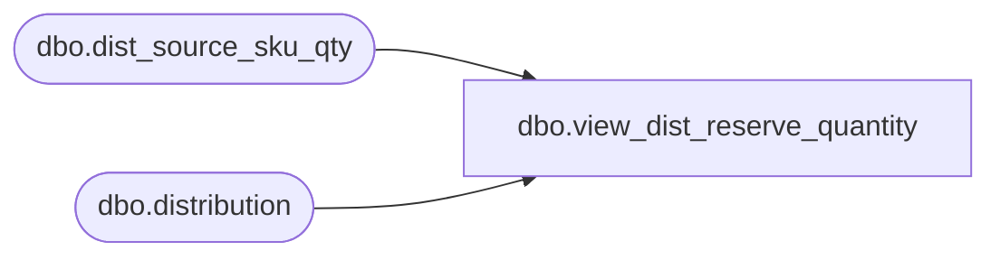

# dbo.view_dist_reserve_quantity

**Database:** me_01  
**Server:** bedrockdb02  

## Architecture Diagram



## Table Dependencies

| Referenced Table |
|---|
| dbo.dist_source_sku_qty |
| dbo.distribution |

## View Code

```sql
create view dbo.view_dist_reserve_quantity AS
SELECT DISTINCT 
  d.distribution_id , 
  SUM(ds.reserve_quantity) total_reserve_quantity
FROM  dist_source_sku_qty ds 
RIGHT OUTER JOIN distribution d 
ON d.distribution_id =ds.distribution_id 
GROUP BY  d.distribution_id
```

