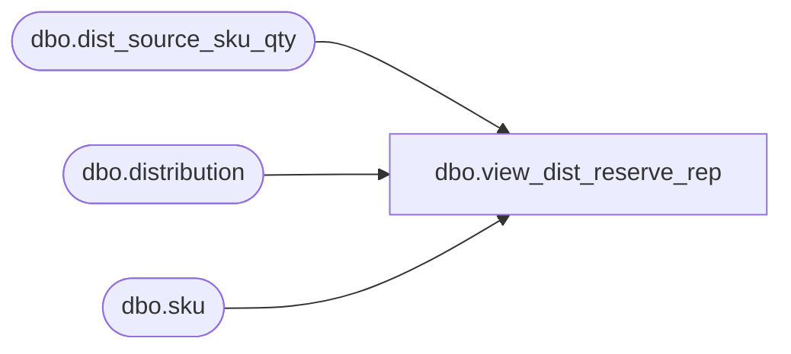

# dbo.view_dist_reserve_rep

**Database:** me_01  
**Server:** bedrockdb02  

## Architecture Diagram



## Table Dependencies

| Referenced Table |
|---|
| dbo.dist_source_sku_qty |
| dbo.distribution |
| dbo.sku |

## View Code

```sql
CREATE VIEW dbo.view_dist_reserve_rep 
AS
SELECT dssq.distribution_id, 
d.po_id,
d.po_shipment_id,
dssq.sku_id,
k.style_color_id, 
dssq.reserve_quantity
FROM dist_source_sku_qty dssq
INNER JOIN distribution d ON d.distribution_id = dssq.distribution_id AND d.document_source = 1
INNER JOIN sku k ON k.sku_id = dssq.sku_id
```

