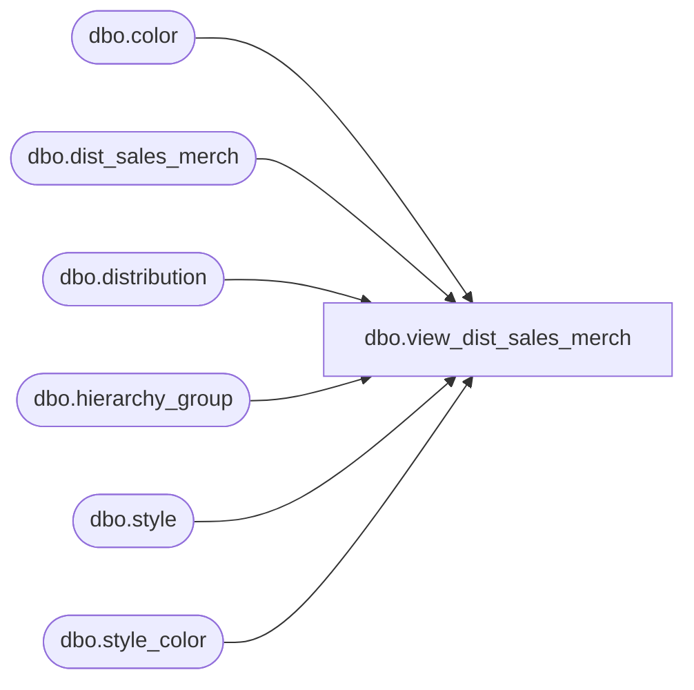

# dbo.view_dist_sales_merch

**Database:** me_01  
**Server:** bedrockdb02  

## Architecture Diagram



## Table Dependencies

| Referenced Table |
|---|
| dbo.color |
| dbo.dist_sales_merch |
| dbo.distribution |
| dbo.hierarchy_group |
| dbo.style |
| dbo.style_color |

## View Code

```sql
create view dbo.view_dist_sales_merch  AS
SELECT DISTINCT
 d.distribution_id,
 ds.hierarchy_group_id,
 h.hierarchy_group_code, 
 h.hierarchy_group_label,
 h.hierarchy_group_short_label,
 s.style_id,
 s.style_code,
 s.long_desc,
 s.short_desc,
 sc.style_color_id,
 sc.long_desc style_color_desc,
 sc.short_desc style_color_short_desc,
 c.color_code,
 c.color_long_description,
 c.color_short_description 
FROM dist_sales_merch ds
RIGHT JOIN distribution d
ON d.distribution_id = ds.distribution_id 
LEFT join  hierarchy_group h
ON  ds.hierarchy_group_id = h.hierarchy_group_id
LEFT JOIN style s
ON ds.style_id = s.style_id
LEFT JOIN  style_color sc
ON ds.style_color_id = sc.style_color_id
LEFT JOIN color c
ON sc.color_id = c.color_id
```

