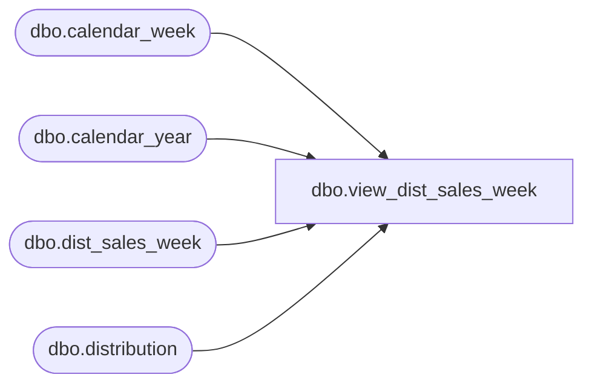

# dbo.view_dist_sales_week

**Database:** me_01  
**Server:** bedrockdb02  

## Architecture Diagram



## Table Dependencies

| Referenced Table |
|---|
| dbo.calendar_week |
| dbo.calendar_year |
| dbo.dist_sales_week |
| dbo.distribution |

## View Code

```sql
create view dbo.view_dist_sales_week  AS
SELECT DISTINCT
 d.distribution_id,
 dw.weight,
 c.calendar_week_id,
 c.sales_cal_yr_code,
 c.sales_cal_wk_code,
 c.sales_cal_yr_wk_code
FROM dist_sales_week dw
LEFT JOIN
(SELECT 
   cw.calendar_week_id,   
   cy.calendar_year_code sales_cal_yr_code,   
   cw.calendar_week_code sales_cal_wk_code,  
  (cy.calendar_year_code *100) + cw.calendar_week_code sales_cal_yr_wk_code  
FROM calendar_week cw, calendar_year cy  
WHERE cw.calendar_year_id = cy.calendar_year_id 
) c
ON dw.calendar_week_id =c.calendar_week_id
RIGHT JOIN distribution d
ON dw.distribution_id =d.distribution_id
```

