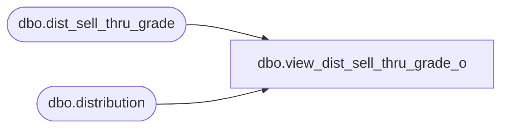

# dbo.view_dist_sell_thru_grade_o

**Database:** me_01  
**Server:** bedrockdb02  

## Architecture Diagram



## Table Dependencies

| Referenced Table |
|---|
| dbo.dist_sell_thru_grade |
| dbo.distribution |

## View Code

```sql
create view dbo.view_dist_sell_thru_grade_o as
select distinct d.distribution_id, ds.dist_sell_thru_grade_id,
ds.grade_code sell_thru_grade_code ,ds.sell_thru_lower_limit
 from distribution d
left join dist_sell_thru_grade ds 
on d.distribution_id =ds.distribution_id


dbo,view_dist_sku_reserve_quantity,create view dbo.view_dist_sku_reserve_quantity 
AS
SELECT DISTINCT 
	d.distribution_id,
	d.distribution_number,
	ds.sku_id,
	ds.reserve_quantity sku_reserve_quantity
FROM  dist_source_sku_qty ds 
RIGHT OUTER JOIN distribution d 
ON d.distribution_id = ds.distribution_id
```

